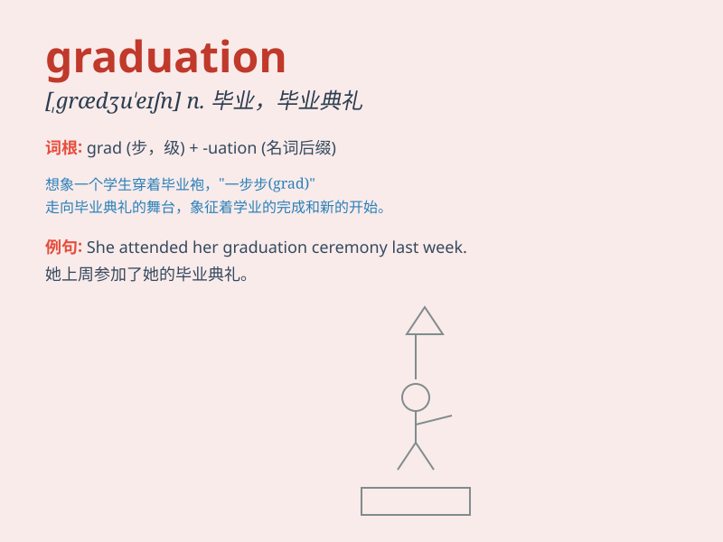

## graduation

**英音:** _[grædʒʊ\'eɪʃ(ə)n; -djʊ-]_ **美音:**
_[,ɡrædʒu\'eʃən]_

**译义:** *n.毕业,毕业典礼,刻度,分等级*

### 短语

+ **graduation ceremony:** _毕业典礼_

+ **graduation project:** _毕业设计_

+ **graduation thesis:** _毕业论文_

+ **graduation certificate:** _毕业证书_

+ **graduation party:** _毕业聚会_

### 例句

#### 例句1

> **After graduation, she decided to travel around the world.**

**中文翻译:** 毕业后，她决定环游世界。

**单词释义:** 毕业

#### 例句2

> **The graduation ceremony was a memorable event for all the
students.**

**中文翻译:** 毕业典礼对所有学生来说都是一次难忘的活动。

**单词释义:** 毕业

#### 例句3

> **His graduation from college marked the beginning of a new chapter
in his life.**

**中文翻译:** 大学毕业标志着他人生新篇章的开始。

**单词释义:** 毕业

### 背诵小故事

> A student named Lily was very nervous before graduation. But when she
put on the graduation cap and received her diploma, all the hard work
paid off. She knew it was a new beginning.

**一个叫莉莉的学生在毕业前非常紧张。但当她戴上毕业帽并拿到毕业证书时，所有的努力都得到了回报。她知道这是一个新的开始。**

### 图义

