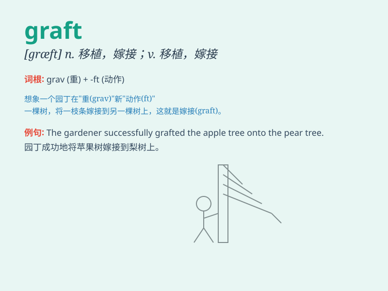

## graft

**英音:** _[grɑːft]_ **美音:** _[ɡræft]_

**译义:**
*n.嫁接,(接技用的)嫩枝,(皮肤等的)移植,赎职v.嫁接,接技,移植(皮肤等),赎职*

### 短语

+ **graft onto:** _嫁接到_

+ **graft in:** _移植入_

+ **skin graft:** _皮肤移植_

+ **graft something together:** _将某物拼接在一起_

+ **graft effort:** _努力嫁接_

### 例句

#### 例句1

> **The surgeon performed a skin graft to treat the burn injury.**

**中文翻译:** 外科医生进行了皮肤移植以治疗烧伤。

**单词释义:** 移植（组织或器官）

#### 例句2

> **He tried to graft new ideas onto the old system.**

**中文翻译:** 他试图将新思想移植到旧制度上。

**单词释义:** 将...嫁接；使结合

#### 例句3

> **The politician was accused of graft and corruption.**

**中文翻译:** 这位政客被指控贪污和腐败。

**单词释义:** 贪污；受贿

### 背诵小故事

> A doctor was performing a difficult graft operation. He needed to
carefully attach a new piece of tissue to the patient\'s body. The
success of the graft would mean a healthy recovery.

**一位医生正在进行一场艰难的移植手术。他需要小心地将新的组织片附着在患者的身体上。移植的成功将意味着患者的健康恢复。**

### 图义

