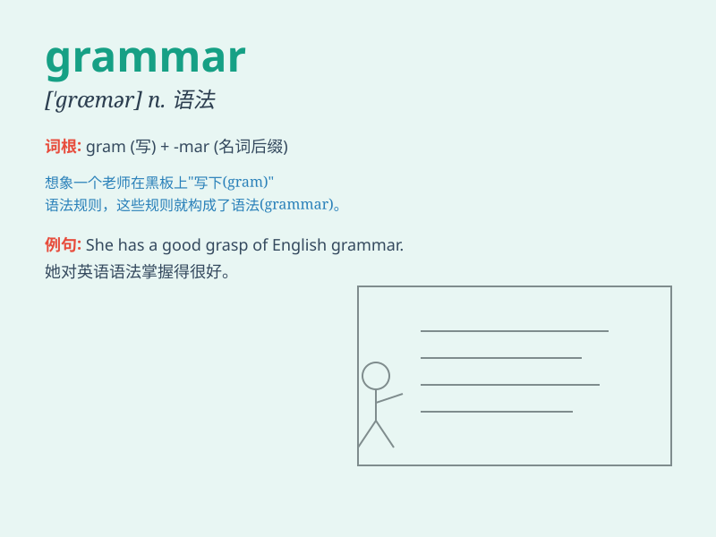

## grammar

**英音:** _[\'græmə]_ **美音:** _[\'græmɚ]_

**译义:** *n.文法,有关原理的书,入门的书*

### 短语

+ **grammar school:** _（英国的）文法学校_

+ **grammar rules:** _语法规则_

+ **English grammar:** _英语语法_

+ **bad grammar:** _语法错误_

+ **grammar book:** _语法书_

### 例句

#### 例句1

> **I need to improve my grammar to write better essays.**

**中文翻译:** 我需要提高语法才能写出更好的论文。

**单词释义:** 语法

#### 例句2

> **The grammar of this language is quite complex.**

**中文翻译:** 这种语言的语法相当复杂。

**单词释义:** 语法

#### 例句3

> **She teaches grammar at the local school.**

**中文翻译:** 她在当地学校教语法。

**单词释义:** 语法

### 背诵小故事

> One day, a little boy was confused about grammar when writing a
story. A magic fairy appeared and taught him the rules clearly. With the
help of the fairy, he mastered grammar and wrote a wonderful story.

**有一天，一个小男孩在写故事时对语法感到困惑。一个神奇的仙女出现了，并清晰地教给他规则。在仙女的帮助下，他掌握了语法，写出了一篇精彩的故事。**

### 图义

