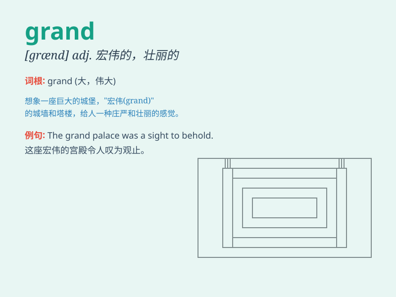

## grand

**英音:** _[grænd]_ **美音:** _[ɡrænd]_

**译义:** *adj.盛大的,豪华的,重大的,主要的,极重要的*

### 短语

+ **grand total:** _总计；总和_

+ **grand piano:** _三角钢琴；大钢琴_

+ **grand design:** _宏伟计划；宏观设计_

+ **grand canyon:** _大峡谷（美国地名）_

+ **grand slam:** _大满贯；全胜_

### 例句

#### 例句1

> **The grand palace is a famous tourist attraction.**

**中文翻译:** 大皇宫是著名的旅游胜地。

**单词释义:** 宏伟的；壮丽的

#### 例句2

> **She has a grand plan for her future.**

**中文翻译:** 她对自己的未来有一个宏伟的计划。

**单词释义:** 宏大的；重大的

#### 例句3

> **The wedding was a grand occasion.**

**中文翻译:** 婚礼是一个盛大的场合。

**单词释义:** 盛大的；豪华的

### 背诵小故事

> A little girl was very excited when she saw the grand castle. It was
so big and beautiful with tall towers. She felt like a princess in a
fairy tale. The word \'grand\' means large and impressive.

**一个小女孩看到宏伟的城堡时非常兴奋。它又大又漂亮，还有高高的塔楼。她感觉自己就像童话故事里的公主。单词\'grand\'意思是宏大的、令人印象深刻的。**

### 图义

