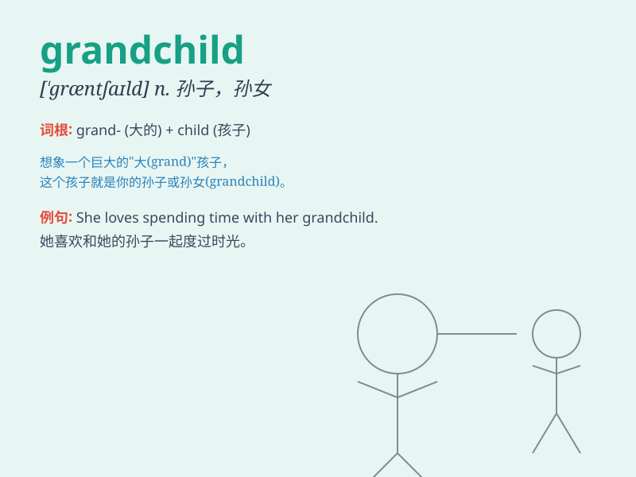

## grandchild

**英音:** _[\'græn(d)tʃaɪld]_ **美音:** _[\'ɡræntʃaɪld]_

**译义:** *n.孙子,孙女*

### 短语

+ **the grandchild of:** _\...\...的孙子/孙女_

+ **young grandchild:** _年幼的孙子/孙女_

+ **adorable grandchild:** _可爱的孙子/孙女_

+ **first grandchild:** _第一个孙子/孙女_

+ **visit grandchild:** _看望孙子/孙女_

### 例句

#### 例句1

> **My grandmother was very happy to see her grandchild.**

**中文翻译:** 我的祖母看到她的孙子非常高兴。

**单词释义:** 孙子/孙女

#### 例句2

> **She has two grandchildren, a boy and a girl.**

**中文翻译:** 她有两个孙子，一个男孩和一个女孩。

**单词释义:** 孙子/孙女

#### 例句3

> **The grandchild brought joy to the entire family.**

**中文翻译:** 孙子的到来给全家人带来了欢乐。

**单词释义:** 孙子/孙女

### 背诵小故事

> One day, a grandma was sitting on a bench in the park. Suddenly, a
little boy ran to her and shouted, \'Grandma!\' The grandma hugged him
and said, \'You are my dear grandchild.\'

**一天，一位奶奶坐在公园的长椅上。突然，一个小男孩跑向她并喊道：'奶奶！'奶奶抱住他说：'你是我亲爱的孙子/孙女。'**

### 图义

