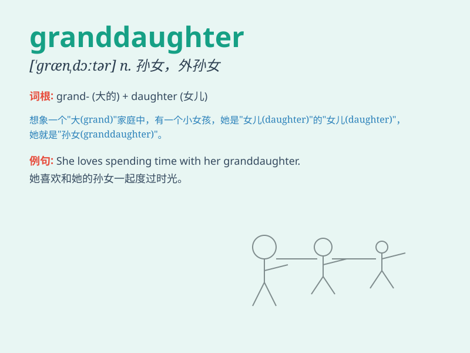

## granddaughter

**英音:** _[\'grændɔːtə]_ **美音:** _[\'ɡrændɔtɚ]_

**译义:** *n.孙女*

### 短语

+ **my granddaughter:** _我的孙女_

+ **lovely granddaughter:** _可爱的孙女_

+ **young granddaughter:** _年幼的孙女_

+ **visit granddaughter:** _看望孙女_

+ **play with granddaughter:** _和孙女一起玩_

### 例句

#### 例句1

> **My granddaughter is very cute and smart.**

**中文翻译:** 我的孙女非常可爱又聪明。

**单词释义:** 孙女

#### 例句2

> **I often play games with my granddaughter on weekends.**

**中文翻译:** 周末我经常和孙女一起玩游戏。

**单词释义:** 孙女

#### 例句3

> **The little granddaughter brought joy to the whole family.**

**中文翻译:** 小孙女给全家人带来了欢乐。

**单词释义:** 孙女

### 背诵小故事

> One day, a little girl was playing in the garden. Her grandma came
and said, \'My dear granddaughter, let\'s have some fun together.\' The
girl smiled happily. The word \'granddaughter\' refers to the daughter
of one\'s son or daughter.

**一天，一个小女孩在花园里玩耍。她的奶奶走过来并说：'亲爱的孙女，咱们一起玩吧。'女孩开心地笑了。单词'granddaughter'指的是儿子或女儿的女儿。**

### 图义

