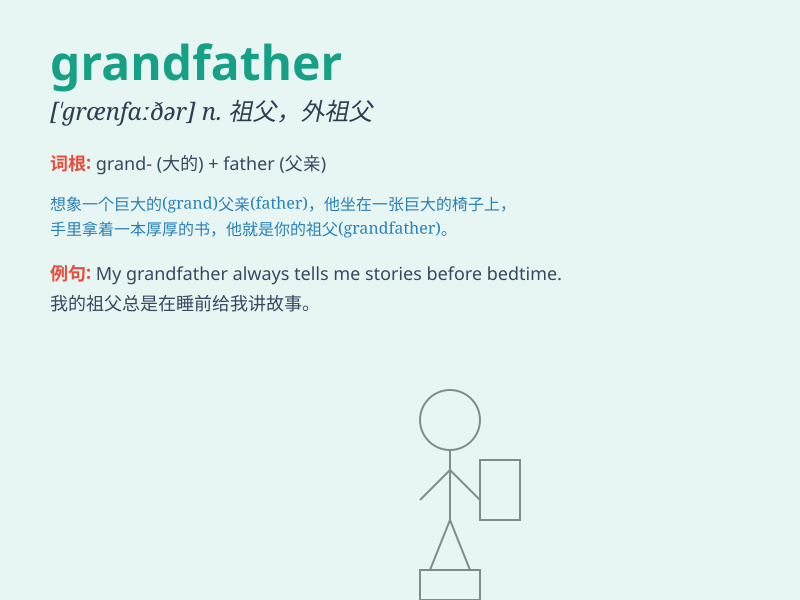

## grandfather

**英音:** _[\'græn(d)fɑːðə]_ **美音:** _[\'græn\'fɑðɚ]_

**译义:** *n.祖父,始祖*

### 短语

+ **maternal grandfather:** _外祖父；外公_

+ **paternal grandfather:** _祖父；爷爷_

+ **great-grandfather:** _曾祖父_

+ **visit one\'s grandfather:** _看望某人的祖父_

+ **live with one\'s grandfather:** _和某人的祖父一起生活_

### 例句

#### 例句1

> **My grandfather is very kind and always tells me stories.**

**中文翻译:** 我的爷爷非常和蔼可亲，总是给我讲故事。

**单词释义:** 祖父

#### 例句2

> **I visited my grandfather\'s farm last weekend.**

**中文翻译:** 上周末我参观了祖父的农场。

**单词释义:** 祖父

#### 例句3

> **Grandfather used to be a soldier during the war.**

**中文翻译:** 祖父在战争期间曾是一名士兵。

**单词释义:** 祖父

### 背诵小故事

> One day, I was lost in the park. A kind old man helped me find my way
home. Later, I learned that he was my grandfather. I was so happy to
have such a caring grandfather.

**有一天，我在公园迷路了。一位和蔼的老人帮我找到了回家的路。后来，我得知他是我的祖父。能有这样一位关心我的祖父，我非常开心。**

### 图义

