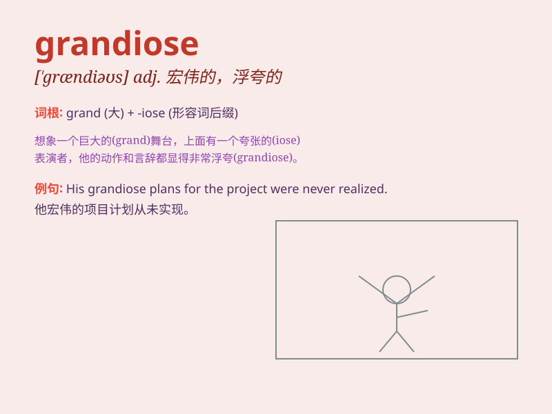

## grandiose

**英音:** _[\'grændɪəʊs]_ **美音:** _[\'ɡrændɪos]_

**译义:** *adj.宏伟的,堂皇的,宏大的*

### 短语

+ **grandiose scheme:** _宏伟的计划_

+ **grandiose building:** _宏伟的建筑_

+ **grandiose idea:** _宏大的想法_

+ **grandiose vision:** _宏伟的愿景_

+ **grandiose project:** _宏伟的项目_

### 例句

#### 例句1

> **The building had a grandiose design with elaborate columns and
high ceilings.**

**中文翻译:** 该建筑设计宏伟，有精致的柱子和高高的天花板。

**单词释义:** 宏伟的；浮夸的

#### 例句2

> **His grandiose plans for world domination never came to
fruition.**

**中文翻译:** 他统治世界的宏伟计划从未实现。

**单词释义:** 浮夸的；不切实际的

#### 例句3

> **The wedding was a grandiose affair with hundreds of guests and a
live orchestra.**

**中文翻译:** 这场婚礼非常盛大，有数百名宾客和现场管弦乐队。

**单词释义:** 盛大的；壮观的

### 背诵小故事

> A king built a grandiose palace. It was huge with shiny gold
decorations and tall towers. Everyone was amazed by its magnificence.
But maintaining it was very costly. \'Grandiose\' means grand and
impressive but often too elaborate or showy.

**一位国王建造了一座宏伟的宫殿。它巨大无比，有着闪亮的黄金装饰和高耸的塔楼。每个人都对它的壮丽感到惊叹。但维持它的费用非常高昂。\'grandiose\'意思是宏伟的、给人深刻印象的，但往往过于华丽或炫耀。**

### 图义

