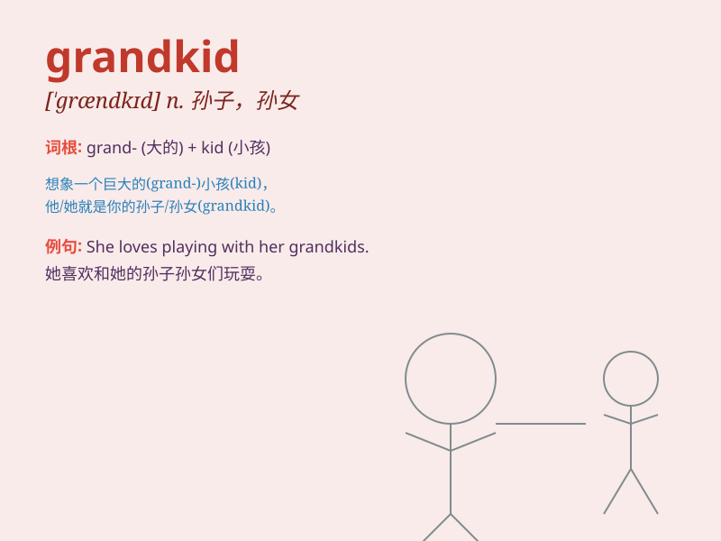

## grandkid

**英音:** _[ˈɡrænkɪd]_ **美音:** _[ˈɡrænkɪd]_

**译义:** *n. 孙子女；外孙子女*

### 短语

+ **lovely grandkid:** _可爱的孙子/孙女_

+ **active grandkid:** _活泼的孙子/孙女_

+ **cute grandkid:** _可爱的孙子/孙女_

+ **naughty grandkid:** _调皮的孙子/孙女_

+ **sweet grandkid:** _贴心的孙子/孙女_

### 例句

#### 例句1

> **I love spending time with my grandkid at the park.**

**中文翻译:** 我喜欢在公园和我的孙辈一起度过时光。

**单词释义:** 孙辈；孙子孙女

#### 例句2

> **The grandkid brought so much joy to the family.**

**中文翻译:** 这个孙辈给家庭带来了很多欢乐。

**单词释义:** 孙辈；孙子孙女

#### 例句3

> **My grandkid is very talented in drawing.**

**中文翻译:** 我的孙子/孙女在绘画方面非常有天赋。

**单词释义:** 孙辈；孙子孙女

### 背诵小故事

> One day, a grandpa was very happy because his grandkid came to visit.
The grandkid brought a big smile to the grandpa\'s face. They played and
had a wonderful time together.

**有一天，一位爷爷非常高兴，因为他的孙子/孙女来看望他。这个孙子/孙女让爷爷脸上洋溢着大大的笑容。他们一起玩耍，度过了一段美好的时光。**

### 图义

