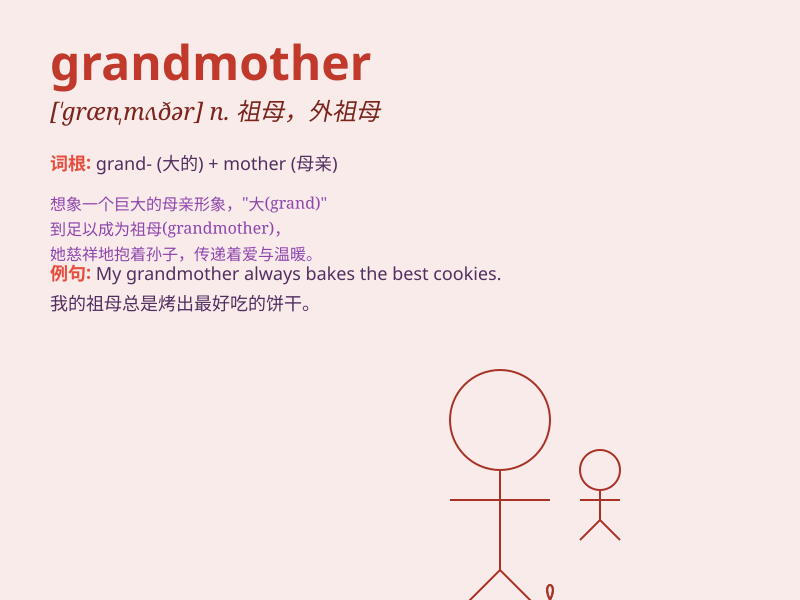

## grandmother

**英音:** _[\'græn(d)mʌðə]_ **美音:** _[\'ɡrænmʌðɚ]_

**译义:** *n.祖母*

### 短语

+ **maternal grandmother:** _外祖母；外婆；姥姥_

+ **paternal grandmother:** _祖母；奶奶_

+ **dear grandmother:** _亲爱的祖母（外祖母）_

+ **old grandmother:** _年迈的祖母（外祖母）_

+ **loving grandmother:** _慈爱的祖母（外祖母）_

### 例句

#### 例句1

> **My grandmother is very kind and always tells me stories.**

**中文翻译:** 我的奶奶非常善良，总是给我讲故事。

**单词释义:** 祖母

#### 例句2

> **I often visit my grandmother on weekends.**

**中文翻译:** 我经常在周末去看望我的祖母。

**单词释义:** 祖母

#### 例句3

> **Grandmother cooked a delicious meal for us.**

**中文翻译:** 奶奶为我们做了一顿可口的饭菜。

**单词释义:** 祖母

### 背诵小故事

> Once upon a time, a little girl was lost. A kind woman helped her
find her way home. The girl later learned that the woman was her
grandmother. She had big smiles and warm hugs. The girl always felt
loved with her grandmother.

**从前，有个小女孩迷路了。一位善良的女士帮她找到了回家的路。女孩后来得知这位女士是她的祖母。她有着大大的笑容和温暖的拥抱。女孩和祖母在一起总是感到被爱。**

### 图义

