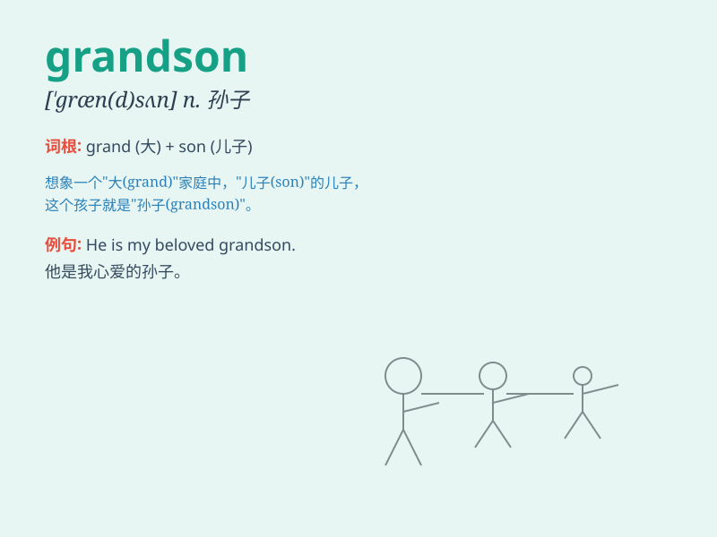

## grandson

**英音:** _[\'græn(d)sʌn]_ **美音:** _[\'ɡrænsʌn]_

**译义:** *n.孙子*

### 短语

+ **favorite grandson:** _最喜爱的孙子_

+ **young grandson:** _年幼的孙子_

+ **dear grandson:** _亲爱的孙子_

+ **clever grandson:** _聪明的孙子_

+ **lovely grandson:** _可爱的孙子_

### 例句

#### 例句1

> **My grandson is very smart and cute.**

**中文翻译:** 我的孙子非常聪明又可爱。

**单词释义:** 孙子

#### 例句2

> **She was so happy to see her grandson after a long time.**

**中文翻译:** 时隔多年再次见到孙子，她感到非常高兴。

**单词释义:** 孙子

#### 例句3

> **The old man often tells stories to his grandson.**

**中文翻译:** 老人经常给他的孙子讲故事。

**单词释义:** 孙子

### 背诵小故事

> One day, a grandpa was very happy because his grandson came to visit.
The grandson brought a big smile to the grandpa\'s face. They spent a
wonderful time together. Remember, grandson is the child of one\'s
child.

**有一天，一位爷爷非常开心，因为他的孙子来看望他。孙子给爷爷带来了大大的笑容。他们一起度过了美好的时光。记住，grandson
就是子女的孩子。**

### 图义

