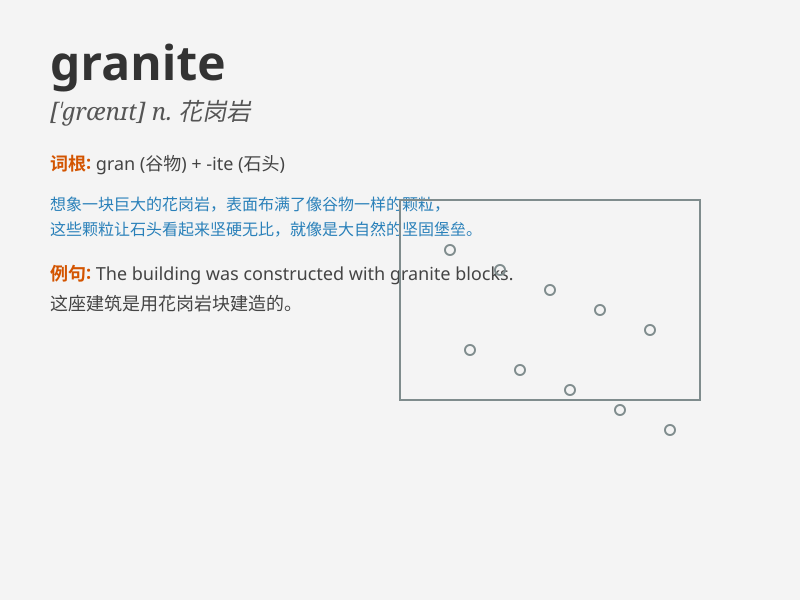

## granite

**英音:** _[\'grænɪt]_ **美音:** _[\'grænɪt]_

**译义:** *n.花岗岩*

### 短语

+ **granite countertop:** _花岗岩台面_

+ **granite quarry:** _花岗岩采石场_

+ **granite monument:** _花岗岩纪念碑_

+ **granite texture:** _花岗岩质地_

+ **granite rock:** _花岗岩岩石_

### 例句

#### 例句1

> **The countertop is made of granite and looks very elegant.**

**中文翻译:** 台面是花岗岩材质的，看起来非常优雅。

**单词释义:** 花岗岩

#### 例句2

> **The mountains are composed of granite rocks.**

**中文翻译:** 山脉由花岗岩组成。

**单词释义:** 花岗岩

#### 例句3

> **The monument was carved from a block of granite.**

**中文翻译:** 纪念碑是用一块花岗岩雕刻而成的。

**单词释义:** 花岗岩

### 背诵小故事

> Once upon a time, a brave miner was digging deep in the mountain. He
finally found a beautiful and hard material - granite. It was so strong
that it could withstand any pressure, just like the miner\'s unwavering
spirit.

**从前，有一个勇敢的矿工在山里深挖。他最终发现了一种美丽且坚硬的物质------花岗岩。它非常坚固，能够承受任何压力，就像矿工坚定不移的精神。**

### 图义

