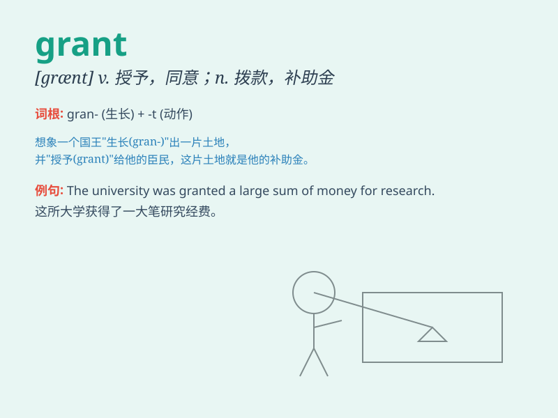

## grant

**英音:** _[grɑːnt]_ **美音:** _[ɡrænt]_

**译义:** *vt.同意,准予,承认(某事为真)～*

### 短语

+ **grant permission:** _准许；允许_

+ **grant a request:** _答应请求_

+ **grant a scholarship:** _授予奖学金_

+ **grant an interview:** _同意接见_

+ **take it for granted:** _认为...理所当然_

### 例句

#### 例句1

> **The government granted permission for the new building
project.**

**中文翻译:** 政府批准了新建筑项目。

**单词释义:** 批准；准许

#### 例句2

> **He was granted a scholarship to study abroad.**

**中文翻译:** 他获得了出国留学的奖学金。

**单词释义:** 授予；给予

#### 例句3

> **I grant that you have a point, but I still think my idea is
better.**

**中文翻译:** 我承认你说的有道理，但我仍然认为我的想法更好。

**单词释义:** 承认；同意

### 背诵小故事

> A poor student was very worried about his tuition. Luckily, a kind
donor granted him a scholarship. The student was so grateful. \'Grant\'
means to give or allow something.

**一个贫困的学生非常担心他的学费。幸运的是，一位善良的捐赠者给予了他一份奖学金。这个学生非常感激。'grant'意思是给予或允许某事。**

### 图义

