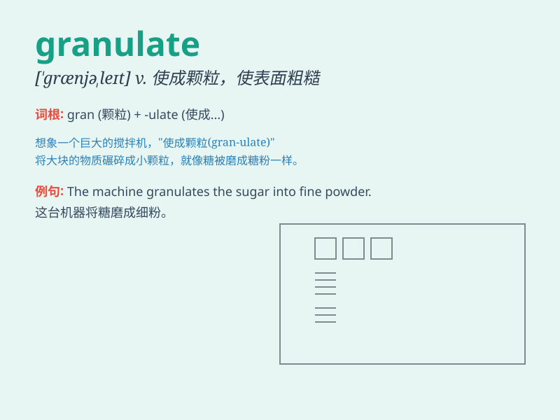

## granulate

**英音:** _[\'grænjʊleɪt]_ **美音:** _[\'grænjə,let]_

**译义:** *v.成为粒状*

### 短语

+ **granulate tissue:** _肉芽组织_

+ **granulate powder:** _粒状粉末_

+ **granulate process:** _造粒过程_

+ **granulate material:** _粒状材料_

+ **granulate into:** _粒化成_

### 例句

#### 例句1

> **The sugar will granulate if you leave it in the open air for too
long.**

**中文翻译:** 如果将糖放在露天太长时间，糖就会形成颗粒。

**单词释义:** 变成颗粒状

#### 例句2

> **The machine is used to granulate plastic materials.**

**中文翻译:** 该机用于塑料材料造粒。

**单词释义:** 使成颗粒

#### 例句3

> **The wound began to granulate and heal.**

**中文翻译:** 伤口开始结痂并愈合。

**单词释义:** （伤口）长出肉芽

### 背诵小故事

> A scientist was observing a special substance. It started to
granulate, like tiny grains of sand coming together. The scientist was
amazed and noted down every detail.

**一位科学家正在观察一种特殊的物质。它开始颗粒化，就像细小的沙粒聚集在一起。科学家感到很惊讶，并记录下了每一个细节。**

### 图义

