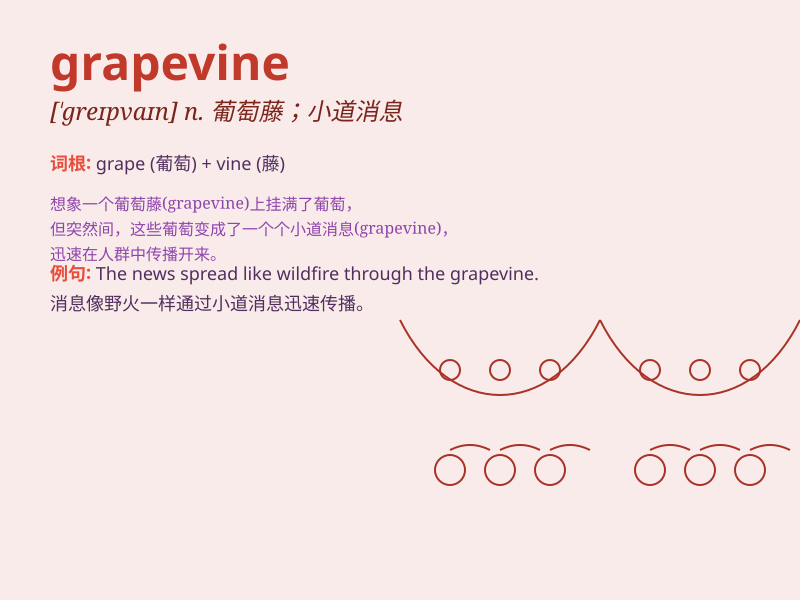

## grapevine

**英音:** _[\'greɪpvaɪn]_ **美音:** _[\'ɡrepvaɪn]_

**译义:** *n.葡萄藤,葡萄树,\<美俗>(秘密情报或)谣言不胫而走*

### 短语

+ **hear through the grapevine:** _从传闻中听说_

+ **grapevine telegraph:** _小道消息传播途径_

+ **grapevine news:** _小道消息；传闻_

+ **rely on the grapevine:** _依赖小道消息_

+ **spread by grapevine:** _通过小道消息传播_

### 例句

#### 例句1

> **I heard the news through the grapevine.**

**中文翻译:** 我是通过小道消息得知这个消息的。

**单词释义:** 小道消息；传闻

#### 例句2

> **The grapevine was abuzz with rumors of a celebrity wedding.**

**中文翻译:** 名人婚礼的传闻甚嚣尘上。

**单词释义:** 小道消息；传闻

#### 例句3

> **Don\'t believe everything you hear on the grapevine.**

**中文翻译:** 不要相信你从小道消息中听到的一切。

**单词释义:** 小道消息；传闻

### 背诵小故事

> Once upon a time, there was a beautiful vineyard full of grapevines.
The workers had to carefully tend to these grapevines to get juicy
grapes. Remember, grapevine here not only means the plant but also
refers to a way of spreading news informally.

**从前，有一个美丽的葡萄园，里面满是葡萄藤。工人们必须精心照料这些葡萄藤才能收获多汁的葡萄。记住，grapevine
在这里不仅指植物，还指非正式的消息传播途径。**

### 图义

