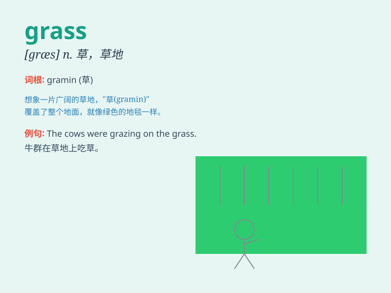

## grass

**英音:** _[grɑːs]_ **美音:** _[ɡræs]_

**译义:** *n.草*

### 短语

+ **grass roots:** _基层；草根_

+ **keep off the grass:** _请勿践踏草坪_

+ **tall grass:** _高草；茂草_

+ **artificial grass:** _人造草_

+ **grass snake:** _草蛇_

### 例句

#### 例句1

> **The sheep are grazing on the grass.**

**中文翻译:** 羊群正在草地上吃草。

**单词释义:** 草；草地

#### 例句2

> **Don\'t walk on the grass.**

**中文翻译:** 不要在草地上行走。

**单词释义:** 草；草地

#### 例句3

> **The grass is always greener on the other side.**

**中文翻译:** 另一边的草总是更绿。

**单词释义:** 草

### 背诵小故事

> One sunny day, a little rabbit hopped happily in the grass. The grass
was so green and soft, like a big green carpet. The rabbit enjoyed
playing and eating the fresh grass. It was a wonderful day in the
grassland.

**在一个阳光明媚的日子，一只小兔子在草地里欢快地蹦跳。草地又绿又软，像一张大大的绿色地毯。兔子开心地玩耍，吃着新鲜的草。这是在草地上美好的一天。**

### 图义

