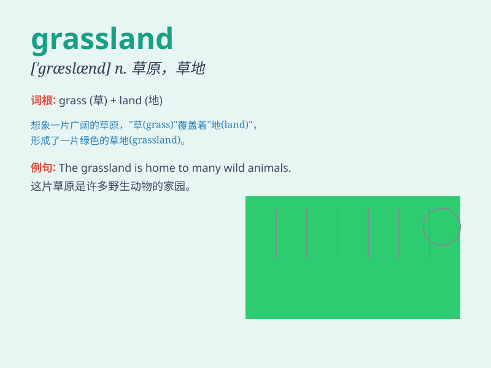

## grassland

**英音:** _[\'grɑːslænd]_ **美音:** _[\'ɡræslænd]_

**译义:** *n.牧草地,草原*

### 短语

+ **vast grassland:** _广阔的草原_

+ **lush grassland:** _茂盛的草原_

+ **rolling grassland:** _起伏的草原_

+ **native grassland:** _原生草原_

+ **endless grassland:** _无边无际的草原_

### 例句

#### 例句1

> **The sheep are grazing on the grassland.**

**中文翻译:** 羊群正在草原上吃草。

**单词释义:** 草地，草原

#### 例句2

> **We went for a picnic in the grassland last weekend.**

**中文翻译:** 上周末我们去草原野餐。

**单词释义:** 草原

#### 例句3

> **The grassland is home to many wild animals.**

**中文翻译:** 草原是许多野生动物的家园。

**单词释义:** 草原

### 背诵小故事

> One day, a little lamb got lost in the grassland. It looked around,
seeing endless grass and wildflowers. Finally, with the help of a kind
shepherd, the lamb found its way home. The grassland was so beautiful
and peaceful.

**有一天，一只小羊羔在草原上迷路了。它环顾四周，看到了一望无际的草和野花。最后，在一位善良的牧羊人的帮助下，小羊羔找到了回家的路。这片草原是如此美丽和宁静。**

### 图义

