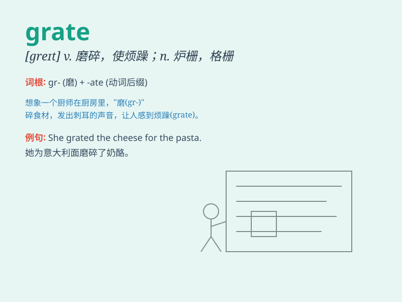

## grate

**英音:** _[greɪt]_ **美音:** _[ɡret]_

**译义:** *n.壁炉,炉*

### 短语

+ **grate cheese:** _磨碎奶酪_

+ **grate ginger:** _磨碎姜_

+ **metal grate:** _金属格栅_

+ **fire grate:** _壁炉炉栅_

+ **grate on someone\'s nerves:** _使某人恼怒；惹某人心烦_

### 例句

#### 例句1

> **The sound of the metal grates against the concrete was
deafening.**

**中文翻译:** 金属格栅撞击混凝土的声音震耳欲聋。

**单词释义:** 发出摩擦声

#### 例句2

> **She grated the cheese into fine pieces.**

**中文翻译:** 她把奶酪磨成细碎的碎片。

**单词释义:** 磨碎

#### 例句3

> **The prisoner looked through the iron grate.**

**中文翻译:** 囚犯透过铁栅栏往外看。

**单词释义:** 栅栏

### 背诵小故事

> A mouse was trying to escape from a cage. Its paws grated against the
metal bars, making a harsh sound. The grate was too strong for the poor
mouse.

**一只老鼠试图从笼子里逃出来。它的爪子在金属条上摩擦，发出刺耳的声音。这个格栅对可怜的老鼠来说太坚固了。**

### 图义

