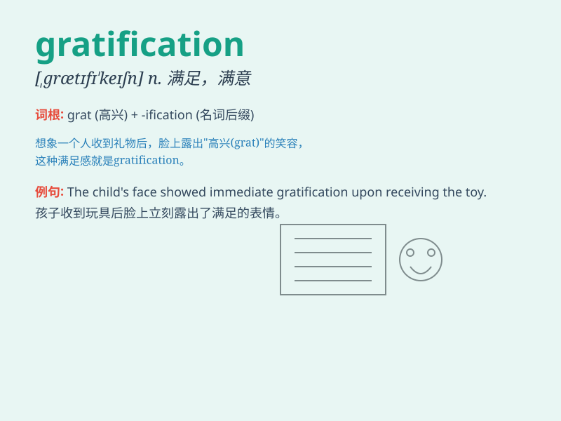

## gratification

**英音:** _[ɡrætɪfɪ\'keɪʃn]_ **美音:**
_[,ɡrætɪfɪ\'keʃən]_

**译义:** *n.满意*

### 短语

+ **instant gratification:** _即时满足_

+ **seek gratification:** _寻求满足_

+ **derive gratification from:** _从\...\...获得满足_

+ **sexual gratification:** _性满足_

+ **find gratification in:** _在\...\...中找到满足_

### 例句

#### 例句1

> **The momentary gratification of eating junk food is often
outweighed by the negative health effects.**

**中文翻译:**
吃垃圾食品带来的短暂满足往往会被对健康的负面影响所抵消。

**单词释义:** 满足；满意；喜悦

#### 例句2

> **He derived great gratification from his success in the
business.**

**中文翻译:** 他对生意上的成功感到非常高兴。

**单词释义:** 满足；满意；令人满足的事物

#### 例句3

> **The child\'s face lit up with gratification when she received the
gift.**

**中文翻译:** 当孩子收到礼物时，脸上露出了欣慰的表情。

**单词释义:** 满足；喜悦

### 背诵小故事

> One day, after a long and tiring week at work, Tom finally received a
bonus. The feeling of getting that bonus was his gratification. It made
all his efforts worthwhile and filled him with joy and satisfaction.

**有一天，在经历了漫长又疲惫的一周工作后，汤姆终于收到了一笔奖金。获得这笔奖金的感觉就是他的满足。这让他所有的努力都变得值得，使他充满了喜悦和满足。**

### 图义

