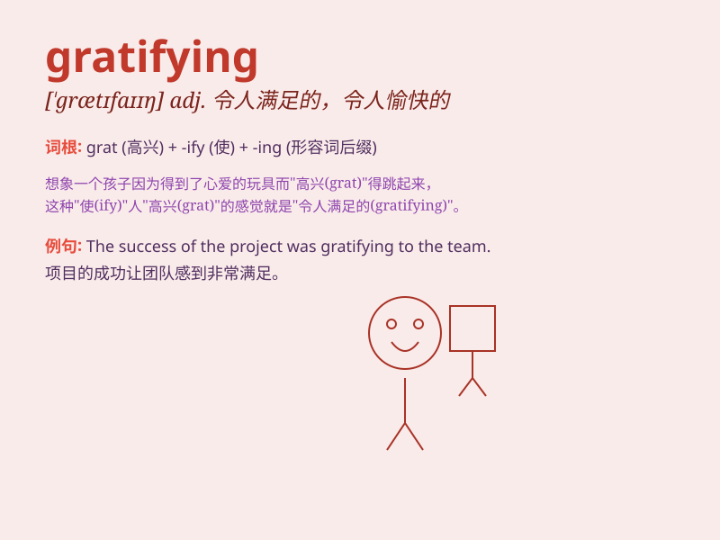

## gratifying

**英音:** _[\'ɡrætɪfaɪɪŋ]_ **美音:** _[\'ɡrætɪfaɪɪŋ]_

**译义:** *adj.悦人的,令人满足的*

### 短语

+ **gratifying result:** _令人满意的结果_

+ **gratifying progress:** _令人欣慰的进展_

+ **find it gratifying:** _觉得令人满意_

+ **a gratifying experience:** _一次令人愉快的经历_

+ **gratifying achievement:** _令人满意的成就_

### 例句

#### 例句1

> **The results of the experiment were gratifying.**

**中文翻译:** 实验结果令人欣喜。

**单词释义:** 令人满意的

#### 例句2

> **It is gratifying to see so many people helping each other.**

**中文翻译:** 很高兴看到这么多人互相帮助。

**单词释义:** 令人欣慰的

#### 例句3

> **The progress he has made is gratifying to his parents.**

**中文翻译:** 他所取得的进步让他的父母感到欣慰。

**单词释义:** 令人高兴的

### 背诵小故事

> A scientist spent years on a research project. Finally, the results
were gratifying. The new discovery brought great benefits and made all
the efforts worthwhile. It was a moment of joy and satisfaction.

**一位科学家在一个研究项目上花费了数年时间。最终，结果令人欣慰。新的发现带来了巨大的益处，让所有的努力都值得了。这是充满喜悦和满足的一刻。**

### 图义

