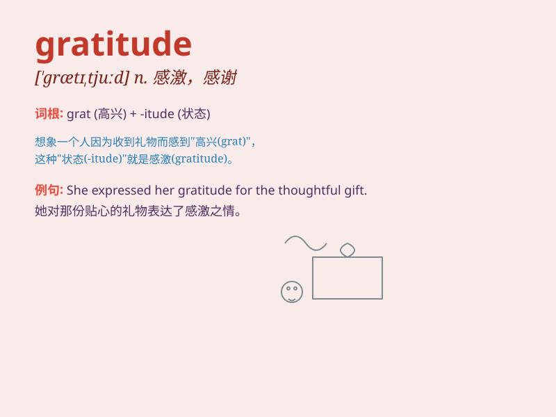

## gratitude

**英音:** _[\'grætɪtjuːd]_ **美音:** _[\'ɡrætɪtud]_

**译义:** *n.感谢的心情*

### 短语

+ **express gratitude:** _表达感激_

+ **feel gratitude:** _感到感激_

+ **deep gratitude:** _深深的感激_

+ **heartfelt gratitude:** _衷心的感激_

+ **show gratitude:** _表示感激_

### 例句

#### 例句1

> **She expressed her gratitude to the doctor for saving her
life.**

**中文翻译:** 她对医生救了她的命表示感谢。

**单词释义:** 感激；感谢

#### 例句2

> **I feel a deep sense of gratitude for your support.**

**中文翻译:** 我对你们的支持深表感谢。

**单词释义:** 感激；感恩

#### 例句3

> **He accepted the gift with gratitude.**

**中文翻译:** 他满怀感激地接受了这份礼物。

**单词释义:** 感激

### 背诵小故事

> One day, when I was lost and hungry, a kind stranger helped me. I
felt so warm and expressed my gratitude. I said, \'Thank you for your
kindness.\' Gratitude means the feeling of being thankful and
appreciative.

**有一天，当我迷路又饥饿时，一位善良的陌生人帮助了我。我感到非常温暖并表达了我的感激之情。我说：'谢谢您的好意。'gratitude
这个单词的意思是感谢和感激的心情。**

### 图义

