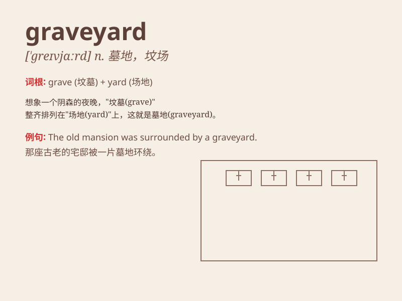

## graveyard

**英音:** _[\'greɪvjɑːd]_ **美音:** _[\'ɡrevjɑrd]_

**译义:** *n.墓地*

### 短语

+ **graveyard shift:** _夜班；大夜班_

+ **haunted graveyard:** _闹鬼的墓地_

+ **old graveyard:** _古老的墓地_

+ **church graveyard:** _教堂墓地_

+ **deserted graveyard:** _荒芜的墓地_

### 例句

#### 例句1

> **The old graveyard is surrounded by a tall fence.**

**中文翻译:** 老墓地周围有高高的栅栏。

**单词释义:** 墓地

#### 例句2

> **They often walk through the graveyard at night to test their
courage.**

**中文翻译:** 他们经常在晚上穿过墓地来测试他们的勇气。

**单词释义:** 墓地

#### 例句3

> **The graveyard was quiet and peaceful under the moonlight.**

**中文翻译:** 月光下的墓地安静祥和。

**单词释义:** 墓地

### 背诵小故事

> One night, a little boy got lost and ended up in a graveyard. He was
very scared. But then he saw a friendly ghost who showed him the way
out. The graveyard was full of tombstones and silence.

**一天晚上，一个小男孩迷路了，最后来到了一个墓地。他非常害怕。但随后他看到了一个友好的鬼魂，鬼魂给他指了出去的路。这个墓地到处都是墓碑和寂静。**

### 图义

