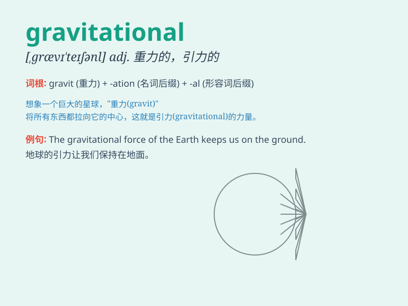

## gravitational

**英音:** _[,ɡrævɪ\'teɪʃənəl]_ **美音:**
_[,ɡrævɪ\'teʃənl]_

**译义:** *adj.重力的*

### 短语

+ **gravitational force:** _引力；重力_

+ **gravitational field:** _引力场；重力场_

+ **gravitational potential:** _引力势；重力势_

+ **gravitational attraction:** _引力吸引；重力吸引_

+ **gravitational collapse:** _引力坍缩_

### 例句

#### 例句1

> **The gravitational pull of the moon affects the tides on
Earth.**

**中文翻译:** 月球的引力影响地球上的潮汐。

**单词释义:** 引力的

#### 例句2

> **Gravitational forces are responsible for keeping planets in orbit
around the sun.**

**中文翻译:** 引力负责使行星保持在围绕太阳的轨道上。

**单词释义:** 引力的

#### 例句3

> **Scientists are studying gravitational waves to gain a deeper
understanding of the universe.**

**中文翻译:** 科学家们正在研究引力波，以更深入地了解宇宙。

**单词释义:** 引力的

### 背诵小故事

> One day, an astronaut was floating in space. He felt the
gravitational pull of the Earth, which was like an invisible force
trying to bring him back. This force is called \'gravitational\'.

**有一天，一位宇航员在太空中漂浮。他感受到了地球的引力，这就像一种无形的力量试图把他拉回去。这种力量就叫做'引力的'。**

### 图义

