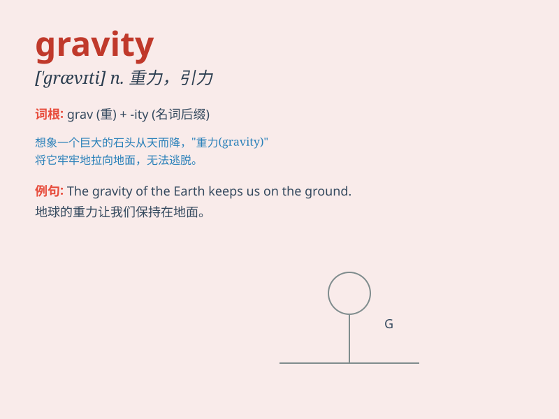

## gravity

**英音:** _[ˈgrævətɪ]_ **美音:** _[ˈɡrævətɪ]_

**译义:** *n.地心引力,重力*

### 短语

+ **center of gravity:** _重心_

+ **specific gravity:** _比重_

+ **gravity field:** _重力场_

+ **gravity anomaly:** _重力异常_

+ **zero gravity:** _零重力；失重_

### 例句

#### 例句1

> **The force of gravity pulls everything towards the center of the
Earth.**

**中文翻译:** 重力将所有物体拉向地球中心。

**单词释义:** 重力

#### 例句2

> **He doesn\'t seem to understand the gravity of the situation.**

**中文翻译:** 他似乎并没有意识到事情的严重性。

**单词释义:** 严重性

#### 例句3

> **The astronaut experienced a strange feeling due to the absence of
gravity.**

**中文翻译:** 由于没有重力，宇航员有一种奇怪的感觉。

**单词释义:** 重力

### 背诵小故事

> One day, an astronaut was floating in space. Suddenly, he felt a
strong pull. It was the gravity of a nearby planet. The force made him
realize how important gravity is for keeping us on the ground.

**有一天，一名宇航员在太空中漂浮。突然，他感觉到一股强大的拉力。这是附近一颗行星的引力。这种力量让他意识到引力对于把我们留在地面上是多么重要。**

### 图义

