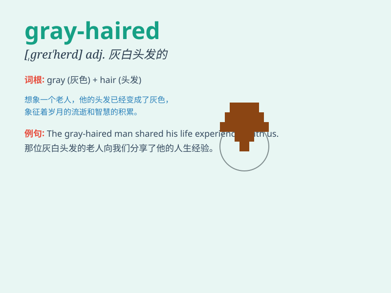

## gray-haired

**英音:** _[ˌɡreɪ ˈheəd]_ **美音:** _[ˌɡreɪ ˈherd]_

**译义:** *adj. 头发灰白的*

### 短语

+ **gray-haired man:** _白发男子_

+ **gray-haired woman:** _白发女子_

+ **a gray-haired couple:** _一对白发夫妻_

+ **gray-haired elders:** _白发长者_

+ **the gray-haired group:** _白发群体_

### 例句

#### 例句1

> **The gray-haired man sat quietly on the park bench.**

**中文翻译:** 这位头发灰白的男人安静地坐在公园长椅上。

**单词释义:** 头发灰白的

#### 例句2

> **I saw a gray-haired woman walking her dog in the
neighborhood.**

**中文翻译:** 我看到一位头发灰白的女士在社区里遛狗。

**单词释义:** 头发灰白的

#### 例句3

> **The gray-haired professor was highly respected by his
students.**

**中文翻译:** 这位头发灰白的教授深受学生们的尊敬。

**单词释义:** 头发灰白的

### 背诵小故事

> Once upon a time, there was an old man. His hair was not black or
brown but gray. People called him the gray-haired man. He was wise and
kind. His gray hair showed his years of experience.

**从前，有一位老人。他的头发不是黑色或棕色的，而是灰色的。人们称他为灰发老人。他睿智又善良。他的灰发显示出他多年的阅历。**

### 图义

