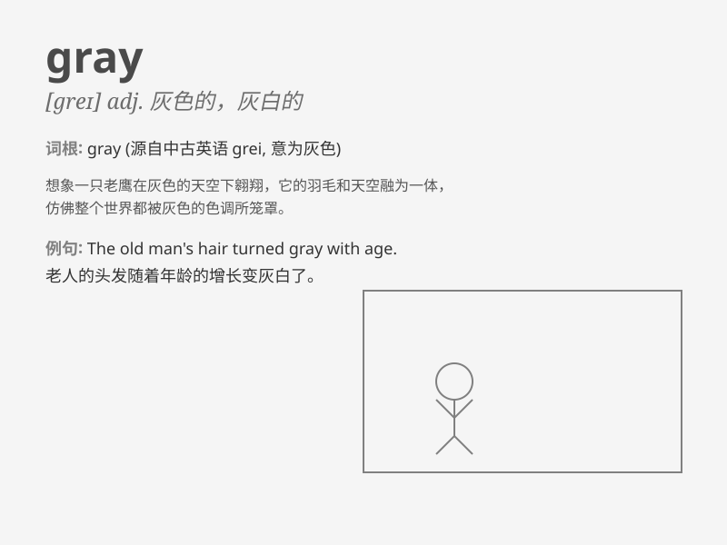

## gray

**英音:** _[greɪ]_ **美音:** _[ɡre]_

**译义:**
*n.灰色,暗淡,灰暗adj.灰色的,灰白的,老的,老练的,阴沉的,\<美俚>广告商的,广告业的
v.(使)变灰色*

### 短语

+ **gray area:** _灰色地带；不明朗的情况_

+ **gray hair:** _白发_

+ **gray market:** _灰色市场_

+ **gray matter:** _灰质（大脑和脊髓中的神经组织）_

+ **turn gray:** _变得灰白_

### 例句

#### 例句1

> **The sky turned gray as the storm approached.**

**中文翻译:** 随着暴风雨的临近，天空变成了灰色。

**单词释义:** 灰色的

#### 例句2

> **She has gray hair and a kind smile.**

**中文翻译:** 她有一头灰白的头发和慈祥的微笑。

**单词释义:** 灰白的

#### 例句3

> **The old building had a gray and worn appearance.**

**中文翻译:** 这座老建筑的外观呈灰色且破旧。

**单词释义:** 灰色的

### 背诵小故事

> One day, a little mouse was walking in a gray cave. It was very dark
and the walls were all gray. The mouse was a bit scared but still kept
going. Finally, it found a way out. Gray means a color between black and
white.

**有一天，一只小老鼠在一个灰色的洞穴里行走。里面非常暗，墙壁都是灰色的。老鼠有点害怕但仍继续前行。最后，它找到了出路。Gray
意思是介于黑色和白色之间的一种颜色。**

### 图义

