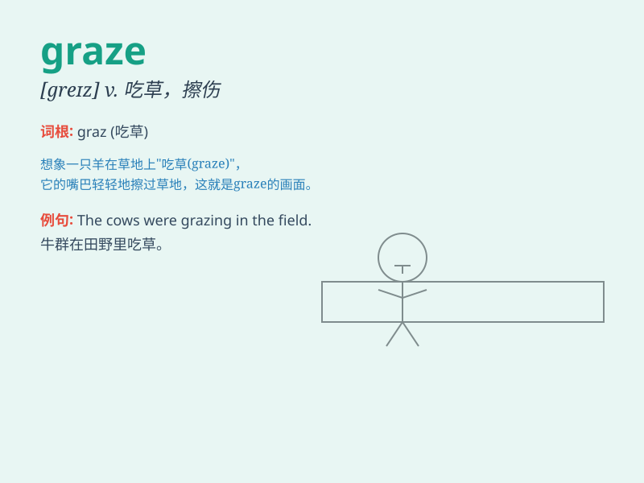

## graze

**英音:** _[greɪz]_ **美音:** _[ɡrez]_

**译义:** *v.放牧,吃草,擦伤,擦过n.放牧,牧草,轻擦,擦破处*

### 短语

+ **graze cattle:** _放牛；放牛吃草_

+ **graze the knee:** _擦伤膝盖_

+ **graze on grass:** _吃草_

+ **lightly graze:** _轻轻擦伤_

+ **graze against:** _擦过；蹭到_

### 例句

#### 例句1

> **The sheep were grazing in the meadow.**

**中文翻译:** 羊群正在草地上吃草。

**单词释义:** 吃草

#### 例句2

> **He grazed his knee when he fell off the bike.**

**中文翻译:** 他从自行车上摔下来时擦伤了膝盖。

**单词释义:** 擦伤

#### 例句3

> **The bullet grazed his shoulder.**

**中文翻译:** 子弹擦过他的肩膀。

**单词释义:** 擦过

### 背诵小故事

> One day, the little sheep were happily playing in the meadow. They
were not careful and grazed their legs on the sharp grass. But with the
care of the shepherd, they soon recovered.

**一天，小羊们在草地上快乐地玩耍。它们不小心，腿在锋利的草上擦伤了。但在牧羊人的照顾下，它们很快就康复了。**

### 图义

