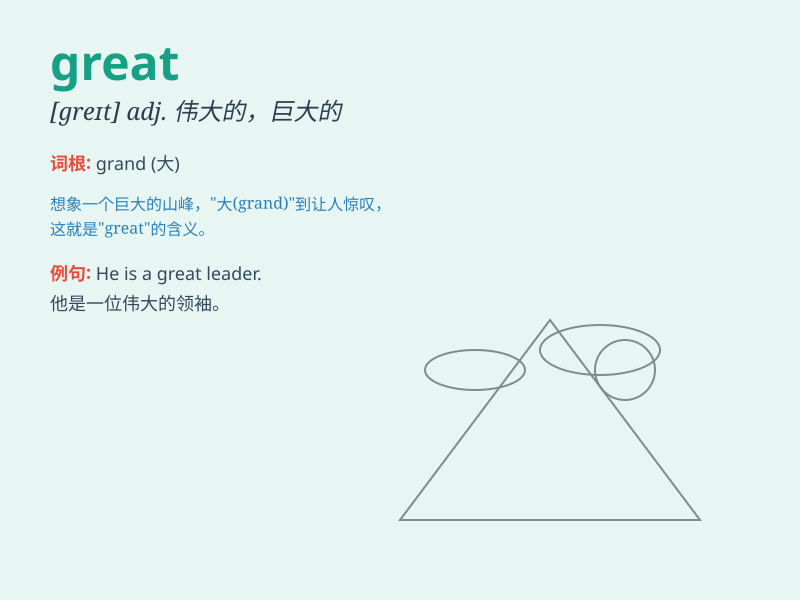

## great

**英音:** _[greɪt]_ **美音:** _[ɡret]_

**译义:**
*adj.伟大的,大的,强烈的,非常的,主要的,大写的,重大的,崇高的adv.顺利地,得意地n.全部,大人物,大师*

### 短语

+ **great deal:** _大量；很多_

+ **great mind:** _伟大的思想家_

+ **great success:** _巨大成功_

+ **great joy:** _巨大的喜悦_

+ **great effort:** _巨大的努力_

### 例句

#### 例句1

> **The Great Wall of China is a famous tourist attraction.**

**中文翻译:** 中国的长城是著名的旅游胜地。

**单词释义:** 伟大的；著名的

#### 例句2

> **You did a great job on the project.**

**中文翻译:** 你在这个项目上做得很好。

**单词释义:** 出色的；极好的

#### 例句3

> **It\'s great to see you again.**

**中文翻译:** 很高兴再次见到你。

**单词释义:** 令人愉快的

### 背诵小故事

> Once upon a time, a little boy climbed a tall mountain. When he
reached the top and saw the vast view, he shouted, \'This is great!\'
meaning it was wonderful and amazing.

**从前，有个小男孩爬上了一座高山。当他到达山顶看到广阔的景色时，他大喊：'这太棒了！'
这里的'great'意思是极好的、令人惊叹的。**

### 图义

