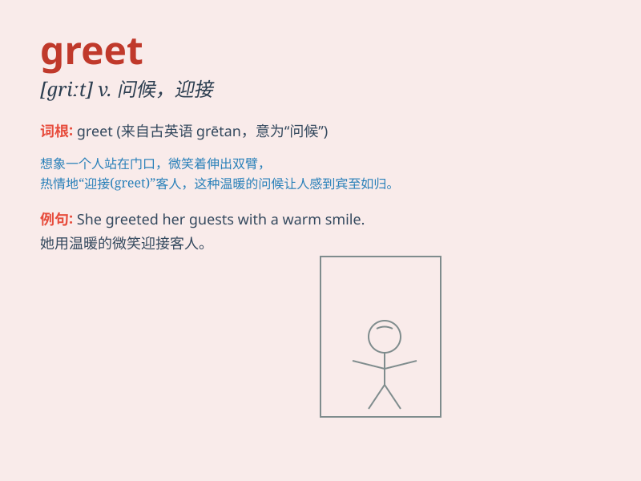

## greet

**英音:** _[griːt]_ **美音:** _[ɡrit]_

**译义:** *vt.问候,向\...致意,获悉(消息),映入眼帘*

### 短语

+ **greet someone warmly:** _热情地问候某人_

+ **greet with a smile:** _微笑着打招呼_

+ **greet the guests:** _迎接客人_

+ **greet the new day:** _迎接新的一天_

+ **greet the news:** _对这个消息表示欢迎_

### 例句

#### 例句1

> **She greeted me with a warm smile.**

**中文翻译:** 她带着温暖的微笑向我打招呼。

**单词释义:** 打招呼；问候

#### 例句2

> **The host greeted the guests at the door.**

**中文翻译:** 主人在门口迎接客人。

**单词释义:** 迎接；欢迎

#### 例句3

> **He greeted the news with excitement.**

**中文翻译:** 他兴奋地迎接这个消息。

**单词释义:** 对待；作出反应

### 背诵小故事

> One day, when Tom was walking in the park, an old friend suddenly
appeared and shouted \'Hello!\' to greet him. Tom was very happy to see
his friend. The word \'greet\' means to say hello or give a friendly
welcome.

**一天，当汤姆在公园散步时，一位老朋友突然出现并大喊'你好！'来问候他。汤姆见到朋友非常高兴。单词'greet'的意思是打招呼或友好地欢迎。**

### 图义

