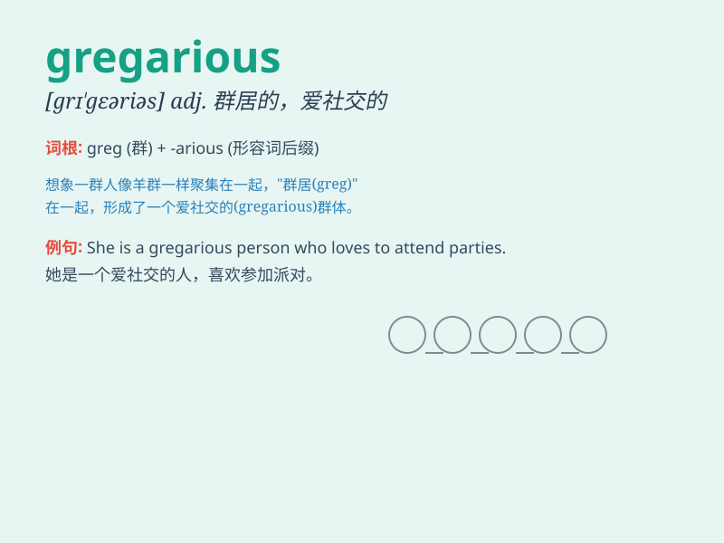

## gregarious

**英音:** _[grɪ\'geərɪəs]_ **美音:** _[grɪ\'gɛrɪəs]_

**译义:** *adj.社交的,群居的*

### 短语

+ **gregarious animals:** _群居动物_

+ **gregarious behavior:** _合群行为_

+ **gregarious personality:** _爱交际的性格_

+ **gregarious lifestyle:** _爱社交的生活方式_

+ **gregarious tendencies:** _合群的倾向_

### 例句

#### 例句1

> **She is a gregarious person who loves to socialize at parties.**

**中文翻译:** 她是一个合群的人，喜欢参加聚会社交。

**单词释义:** 爱交际的

#### 例句2

> **The gregarious birds gather in large flocks.**

**中文翻译:** 群居的鸟儿聚集成大群。

**单词释义:** 群居的

#### 例句3

> **He has a gregarious nature and makes friends easily.**

**中文翻译:** 他性格开朗，很容易交到朋友。

**单词释义:** 性格开朗的

### 背诵小故事

> A lonely sheep was always sad. One day, it met a group of gregarious
sheep who loved to play and talk together. The lonely sheep joined them
and became happy. Gregarious means sociable and fond of company.

**一只孤独的绵羊总是很悲伤。有一天，它遇到了一群喜欢一起玩耍和交流的合群的绵羊。这只孤独的绵羊加入了它们，变得快乐起来。gregarious
意思是爱社交的、合群的。**

### 图义

