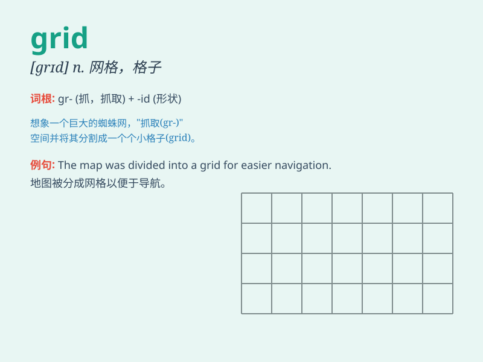

## grid

**英音:** _[grɪd]_ **美音:** _[ɡrɪd]_

**译义:** *n.格子,栅格*

### 短语

+ **power grid:** _电网_

+ **grid system:** _网格系统；坐标方格系统_

+ **grid computing:** _网格计算_

+ **street grid:** _街道网格_

+ **grid pattern:** _网格图案；方格图案_

### 例句

#### 例句1

> **The city\'s power grid was damaged by the storm.**

**中文翻译:** 该市的电网因暴风雨而受损。

**单词释义:** 电力网；输电网

#### 例句2

> **She placed the photos on a grid on the wall.**

**中文翻译:** 她把照片放在墙上的网格上。

**单词释义:** 网格；方格

#### 例句3

> **The map is marked with a grid of lines.**

**中文翻译:** 地图上标有网格线。

**单词释义:** 网格；方格

### 背诵小故事

> Imagine a city in a blackout. People are lost because the power grid
fails. The grid of wires and towers that usually bring light is now
dark. It\'s like a maze without a way out. Remember, grid means a
network of lines or a pattern of crossed lines.

**想象一下城市停电。人们不知所措，因为电网故障。通常带来光明的电线和塔架组成的网格现在一片漆黑。就像一个没有出路的迷宫。记住，grid
意思是网格、格子**

### 图义

