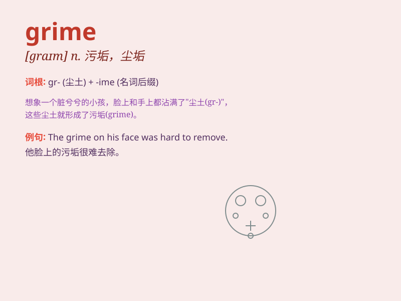

## grime

**英音:** _[graɪm]_ **美音:** _[ɡraɪm]_

**译义:** *n.尘垢,污点,煤尘vt.使污秽,污浊*

### 短语

+ **coal grime:** _煤尘_

+ **industrial grime:** _工业污垢_

+ **remove grime:** _去除污垢_

+ **grime layer:** _污垢层_

+ **face covered with grime:** _满脸污垢_

### 例句

#### 例句1

> **The windows were covered in grime.**

**中文翻译:** 窗户上布满了污垢。

**单词释义:** 污垢；尘垢

#### 例句2

> **His face was smeared with grime after a long day at the
factory.**

**中文翻译:** 在工厂工作了一天后，他的脸上沾满了污垢。

**单词释义:** 污垢；尘垢

#### 例句3

> **The old bike was caked with grime.**

**中文翻译:** 那辆旧自行车沾满了污垢。

**单词释义:** 污垢；尘垢

### 背诵小故事

> A brave cleaner was determined to remove the grime from the old
castle. Every corner was covered with thick grime, but he didn\'t give
up. Finally, the castle became shiny and clean.

**一位勇敢的清洁工决心清除旧城堡上的污垢。每个角落都覆盖着厚厚的污垢，但他没有放弃。最终，城堡变得闪亮又干净。**

### 图义

