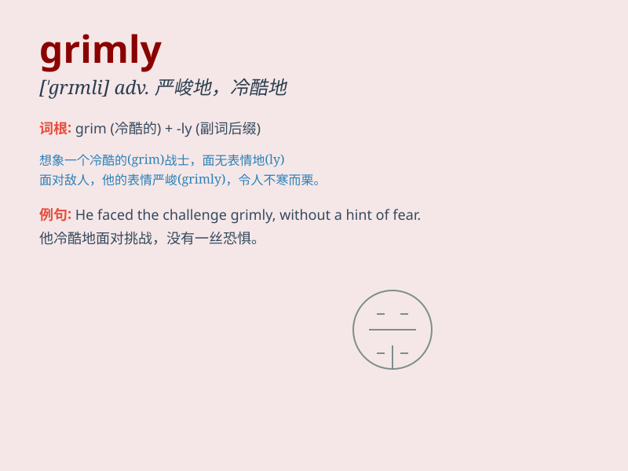

## grimly

**英音:** _[\'grɪmlɪ]_ **美音:** _[\'grɪmlɪ]_

**译义:** *adv.严格地,可怕地,冷酷地*

### 短语

+ **grimly determined:** _坚定而严峻地_

+ **grimly serious:** _极其严肃地_

+ **grimly silent:** _严峻地沉默_

+ **grimly realistic:** _冷酷地现实_

+ **grimly aware:** _严峻地意识到_

### 例句

#### 例句1

> **He grimly faced the difficult challenge ahead.**

**中文翻译:** 他严峻地面对着面前的艰巨挑战。

**单词释义:** 严峻地

#### 例句2

> **She grimly held on to her beliefs despite the criticism.**

**中文翻译:** 尽管受到批评，她仍然坚持自己的信仰。

**单词释义:** 坚定地

#### 例句3

> **The doctor grimly informed us of the bad news.**

**中文翻译:** 医生严肃地告诉我们这个坏消息。

**单词释义:** 严肃地

### 背诵小故事

> A brave knight faced the dark forest grimly. The path was full of
unknown dangers, but he held his sword tightly, determined not to show
fear. His expression was grimly serious as he moved forward.

**一位勇敢的骑士严峻地面对黑暗的森林。道路充满未知的危险，但他紧紧握住剑，决心不露出恐惧。他表情严峻，严肃地向前迈进。**

### 图义

