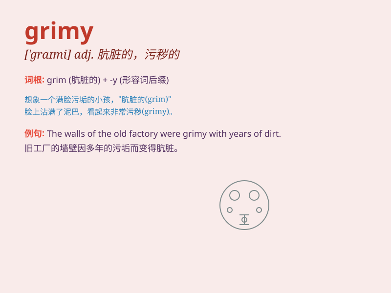

## grimy

**英音:** _[\'graɪmɪ]_ **美音:** _[\'ɡraɪmi]_

**译义:** *adj.污秽的,肮脏的*

### 短语

+ **grimy hands:** _肮脏的手_

+ **grimy face:** _满是污垢的脸_

+ **grimy clothes:** _脏衣服_

+ **grimy room:** _脏兮兮的房间_

+ **grimy window:** _布满灰尘的窗户_

### 例句

#### 例句1

> **The miner\'s face was grimy after a long day in the mine.**

**中文翻译:** 在矿井里工作了一整天后，这位矿工的脸脏兮兮的。

**单词释义:** 肮脏的；沾满污垢的

#### 例句2

> **The windows of the abandoned house were grimy and opaque.**

**中文翻译:** 废弃房屋的窗户肮脏且不透明。

**单词释义:** 肮脏的；满是灰尘的

#### 例句3

> **He wiped the grimy sweat from his forehead.**

**中文翻译:** 他擦掉额头上的脏汗。

**单词释义:** 肮脏的；污秽的

### 背诵小故事

> A little mouse was lost in a grimy cave. The walls were covered with
dirt and dust. It struggled to find its way out. Finally, it escaped and
never wanted to go to such a grimy place again.

**一只小老鼠在一个肮脏的洞穴里迷路了。洞壁布满了污垢和灰尘。它努力寻找出路。最后，它逃了出来，再也不想去这么肮脏的地方了。**

### 图义

