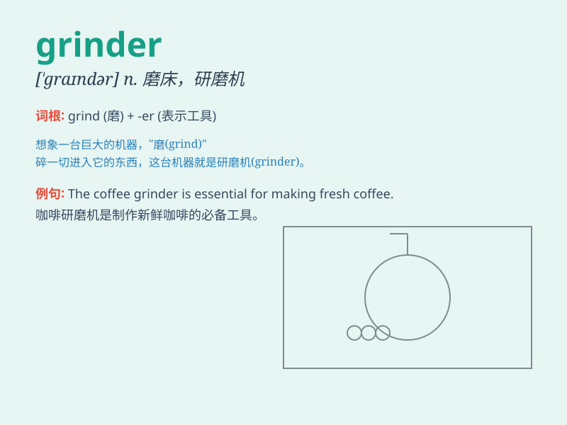

## grinder

**英音:** _[\'graɪndə]_ **美音:** _[\'ɡraɪndɚ]_

**译义:** *n.磨工,尤指磨刀具的工人,研磨者,\<美俚>脱衣舞女演员*

### 短语

+ **coffee grinder:** _咖啡研磨机_

+ **meat grinder:** _绞肉机_

+ **angle grinder:** _角磨机_

+ **pepper grinder:** _胡椒研磨器_

+ **spice grinder:** _香料研磨器_

### 例句

#### 例句1

> **The coffee grinder broke down this morning.**

**中文翻译:** 今天早上咖啡研磨机坏了。

**单词释义:** 研磨机

#### 例句2

> **He is a political grinder who never gives up easily.**

**中文翻译:** 他是一个从不轻易放弃的政治磨练者。

**单词释义:** 苦干的人；不屈不挠的人

#### 例句3

> **The grinder of the gears made a strange noise.**

**中文翻译:** 齿轮研磨机发出奇怪的声音。

**单词释义:** 研磨装置

### 背诵小故事

> A hungry mouse was looking for food in a dark corner. Suddenly, it
found a grinder full of grains. It was so excited and started to eat.
But the grinder was too big for it to move.

**一只饥饿的老鼠在黑暗的角落里寻找食物。突然，它发现了一个装满谷物的研磨机。它非常兴奋并开始吃。但研磨机对它来说太大了，根本搬不动。**

### 图义

