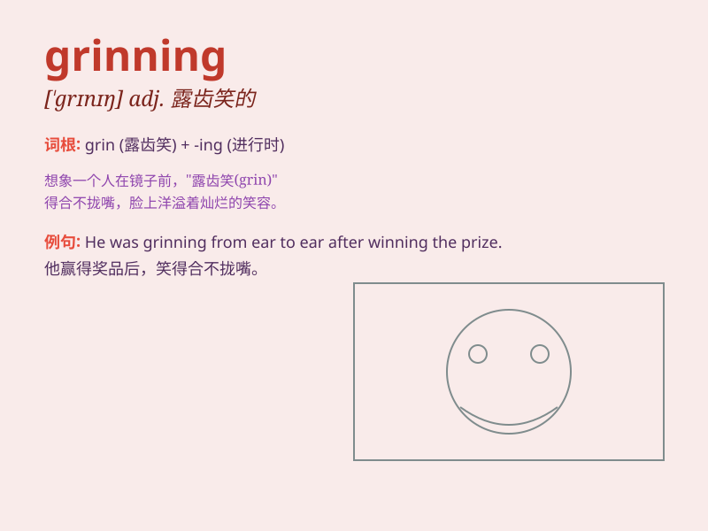

## grinning

**英音:** _[ˈɡrɪnɪŋ]_ **美音:** _[ˈɡrɪnɪŋ]_

**译义:** *adj. 露齿而笑的，咧嘴笑的；v. 露齿而笑（grin
的现在分词）*

### 短语

+ **grinning face:** _咧嘴笑的脸_

+ **keep grinning:** _一直咧着嘴笑_

+ **wide grinning:** _大大的咧嘴笑_

+ **grinning broadly:** _咧嘴大笑_

+ **grinning mischievously:** _调皮地咧嘴笑_

### 例句

#### 例句1

> **He was grinning from ear to ear when he heard the good news.**

**中文翻译:** 当他听到这个好消息时，笑得合不拢嘴。

**单词释义:** 咧嘴笑；露齿而笑

#### 例句2

> **The children were grinning happily as they played in the
park.**

**中文翻译:** 孩子们在公园里玩耍时开心地咧嘴笑着。

**单词释义:** 露齿笑；咧嘴笑

#### 例句3

> **She caught him grinning mischievously at her.**

**中文翻译:** 她发现他调皮地朝她咧嘴笑。

**单词释义:** 狡黠地笑；坏笑

### 背诵小故事

> One day, I saw a monkey in the zoo. It was grinning widely, showing
all its teeth. It seemed so happy and funny. The way it was grinning
made me laugh a lot.

**有一天，我在动物园看到一只猴子。它咧着嘴笑得很开，露出了所有的牙齿。它看起来非常开心和有趣。它咧嘴笑的样子让我大笑不止。**

### 图义

