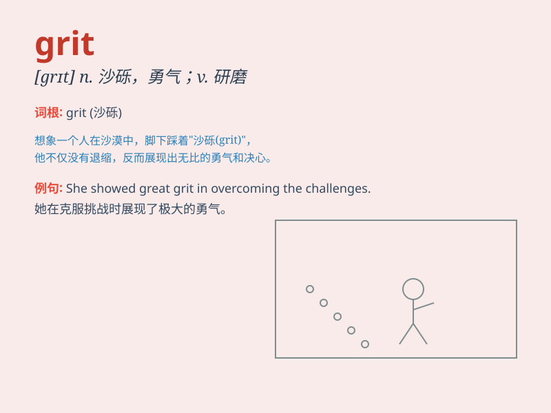

## grit

**英音:** _[grɪt]_ **美音:** _[ɡrɪt]_

**译义:** *n.粗砂v.研磨,在\...上铺砂砾*

### 短语

+ **grit one\'s teeth:** _咬紧牙关；下定决心_

+ **grit determination:** _坚毅的决心_

+ **grit size:** _粒度；砂粒尺寸_

+ **road grit:** _道路防滑砂_

+ **grit blasting:** _喷砂；喷丸清理_

### 例句

#### 例句1

> **She showed remarkable grit in the face of adversity.**

**中文翻译:** 面对逆境，她表现出了非凡的毅力。

**单词释义:** 勇气；毅力

#### 例句2

> **The grit on the road made it slippery for the cars.**

**中文翻译:** 路上的沙砾使汽车变得很滑。

**单词释义:** 沙砾；砂粒

#### 例句3

> **He gritted his teeth and pushed forward with the heavy load.**

**中文翻译:** 他咬紧牙关，负重前行。

**单词释义:** 咬紧（牙齿）

### 背诵小故事

> A brave little ant was trying to cross a sandy path. Despite the
rough sand and strong wind, it kept moving forward with grit. It showed
that grit means determination and perseverance in the face of
difficulties.

**一只勇敢的小蚂蚁试图穿过一条满是沙子的小路。尽管沙子粗糙，风又大，它还是凭借着毅力不断前进。这表明了
grit 这个词意味着在困难面前的决心和坚持不懈。**

### 图义

