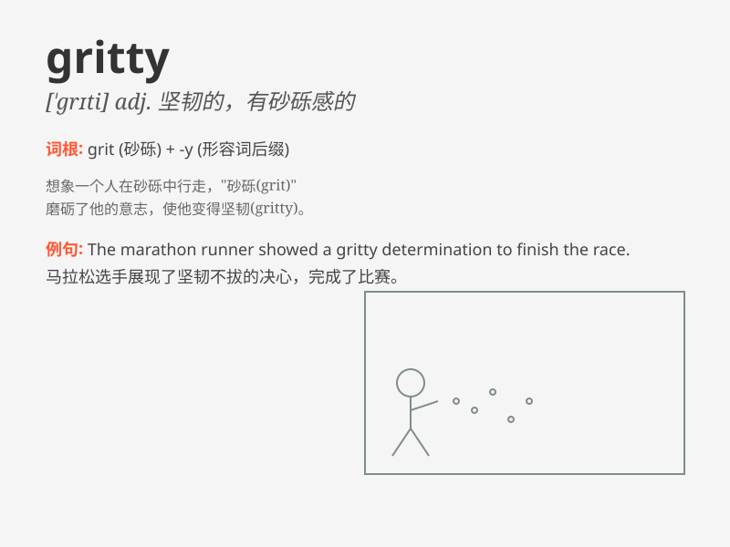

## gritty

**英音:** _[\'grɪtɪ]_ **美音:** _[\'grɪti]_

**译义:** *adj.有砂砾的,坚韧不拔的*

### 短语

+ **gritty determination:** _坚定的决心_

+ **gritty reality:** _严峻的现实_

+ **gritty performance:** _坚韧的表现_

+ **gritty fighter:** _坚毅的战士_

+ **gritty texture:** _粗糙的质地_

### 例句

#### 例句1

> **The gritty texture of the sandpaper made it ideal for smoothing
rough surfaces.**

**中文翻译:** 砂纸的粗糙质地使其非常适合打磨粗糙的表面。

**单词释义:** 粗糙的

#### 例句2

> **The movie offered a gritty portrayal of life in the inner
city.**

**中文翻译:** 这部电影对市中心的生活进行了真实而又残酷的描绘。

**单词释义:** 真实而又残酷的

#### 例句3

> **She showed a gritty determination to succeed despite the
odds.**

**中文翻译:** 尽管困难重重，她还是展现出了坚定的成功决心。

**单词释义:** 坚定的

### 背诵小故事

> A brave miner was working deep in the mine. The environment was
gritty, filled with dust and small stones. But he didn\'t give up.
Gritty here means having a rough and dirty quality.

**一位勇敢的矿工在矿井深处工作。环境充满了砂砾，到处是灰尘和小石子。但他没有放弃。这里的gritty意思是有粗糙且脏的特质。**

### 图义

