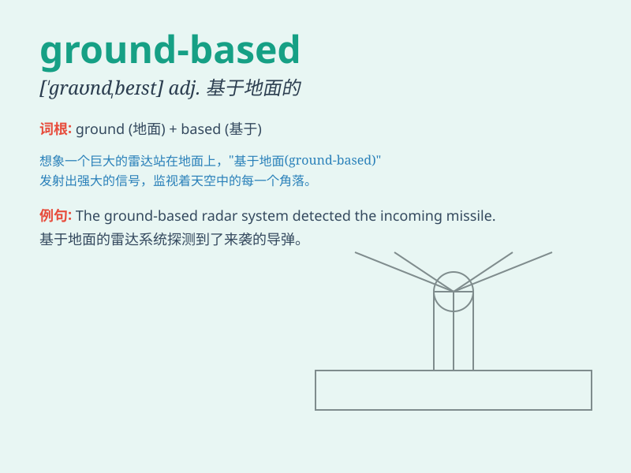

## ground-based

**英音:** _[ˈɡraʊnd beɪst]_ **美音:** _[ˈɡraʊnd beɪst]_

**译义:** *以地面为基础的；地面的；陆基的*

### 短语

+ **ground-based radar:** _地基雷达_

+ **ground-based telescope:** _地面望远镜_

+ **ground-based observation:** _地面观测_

+ **ground-based station:** _地面站_

+ **ground-based system:** _地面系统_

### 例句

#### 例句1

> **The ground-based telescope provides clear images of distant
galaxies.**

**中文翻译:** 地基望远镜提供了遥远星系的清晰图像。

**单词释义:** 基于地面的

#### 例句2

> **Ground-based radar systems are crucial for air traffic
control.**

**中文翻译:** 地面雷达系统对空中交通管制至关重要。

**单词释义:** 以地面为基础的

#### 例句3

> **The ground-based observation station collects data on weather
patterns.**

**中文翻译:** 地面观测站收集天气模式的数据。

**单词释义:** 在地面上的

### 背诵小故事

> Imagine a group of scientists working on a special project. They have
equipment placed firmly on the ground. This equipment is called
ground-based, meaning based or located on the ground.

**想象一群科学家在做一个特殊的项目。他们有稳稳放置在地面上的设备。这种设备就被称为
ground-based，意思是基于地面的或位于地面的。**

### 图义

