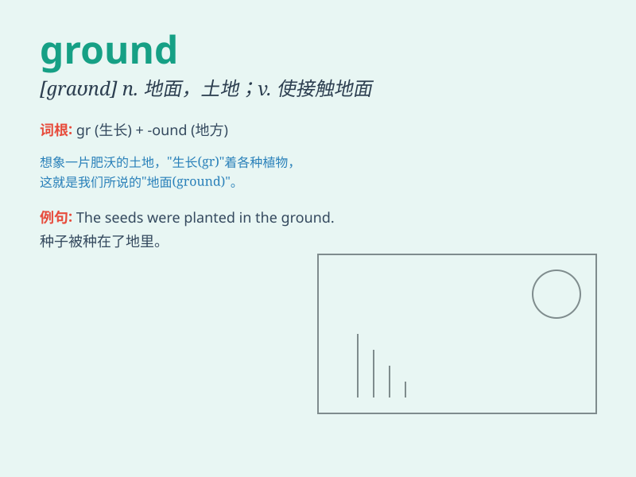

## ground

**英音:** _[graʊnd]_ **美音:** _[ɡraʊnd]_

**译义:**
*n.地面,土地,战场,场所,范围adj.土地的,地面上的vt.把\...放在地上,使搁浅,打基础vi.具有基础,着陆,搁浅
vbl.grind的过去式*

### 短语

+ **ground floor:** _底层；一楼_

+ **on the ground:** _在地上；当场_

+ **break ground:** _破土动工；开创；起步_

+ **common ground:** _共同点；共同基础_

+ **ground rules:** _基本规则；基本原则_

### 例句

#### 例句1

> **The children were playing on the ground.**

**中文翻译:** 孩子们正在地上玩耍。

**单词释义:** 地面；土地

#### 例句2

> **She lost her ground in the argument.**

**中文翻译:** 她在争论中失去了优势。

**单词释义:** 优势；根据

#### 例句3

> **The pilot was forced to make an emergency landing on rough
ground.**

**中文翻译:** 飞行员被迫在崎岖的地面紧急降落。

**单词释义:** 地面；场地

### 背诵小故事

> A little bird lost its way and fell to the ground. It was scared but
soon found a friendly worm on the ground. The worm helped the bird stand
up and fly again. The ground was not so scary after all.

**一只小鸟迷路了，掉到了地上。它很害怕，但很快在地上发现了一只友好的虫子。虫子帮助小鸟站起来再次飞翔。毕竟地面也没那么可怕。**

### 图义

