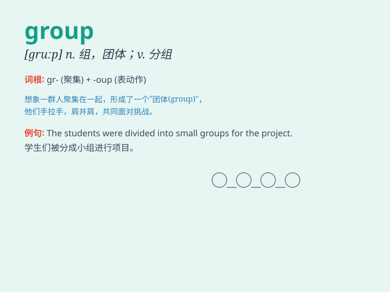

## group

**英音:** _[gruːp]_ **美音:** _[ɡrup]_

**译义:** *n.团体,组,团,群,批,[地]界,[化]基v.聚合,成群*

### 短语

+ **group discussion:** _小组讨论_

+ **a group of:** _一群；一组；一伙_

+ **interest group:** _利益集团；兴趣小组_

+ **working group:** _工作小组；工作组_

+ **age group:** _年龄组；年龄段_

### 例句

#### 例句1

> **The students were divided into several groups for the
project.**

**中文翻译:** 学生们为这个项目被分成了几个小组。

**单词释义:** 组，团体

#### 例句2

> **A group of tourists is visiting the museum.**

**中文翻译:** 一群游客正在参观博物馆。

**单词释义:** 群，批

#### 例句3

> **The rock band is a popular group.**

**中文翻译:** 这个摇滚乐队是一个受欢迎的团体。

**单词释义:** 团体，乐队

### 背诵小故事

> A group of little animals was lost in the forest. They were very
scared. But they held together and finally found their way home. Here,
\'group\' means a collection of things or people.

**一群小动物在森林里迷路了。它们非常害怕。但它们团结在一起，最终找到了回家的路。这里，\'group\'意思是一群人或物的集合。**

### 图义

