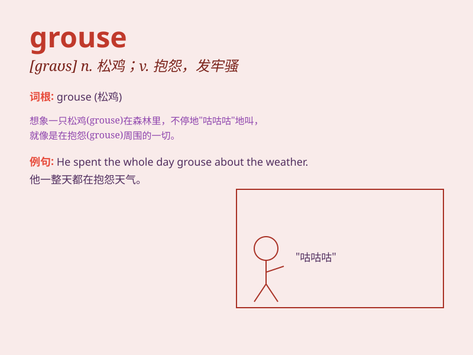

## grouse

**英音:** _[graʊs]_ **美音:** _[ɡraʊs]_

**译义:** *n.松鸡,牢骚vi.埋怨*

### 短语

+ **grouse about:** _抱怨；发牢骚_

+ **grouse hunting:** _松鸡狩猎_

+ **mountain grouse:** _山松鸡_

+ **grouse moor:** _松鸡沼地_

+ **grouse season:** _松鸡狩猎季_

### 例句

#### 例句1

> **He\'s always grousing about the weather.**

**中文翻译:** 他总是抱怨天气。

**单词释义:** 抱怨

#### 例句2

> **The workers groused that they were not paid enough.**

**中文翻译:** 工人们发牢骚说他们的工资太低。

**单词释义:** 发牢骚

#### 例句3

> **She groused to her friend about the long hours at work.**

**中文翻译:** 她向朋友抱怨工作时间太长。

**单词释义:** 抱怨

### 背诵小故事

> A hunter went into the forest to hunt grouse. He searched for a long
time but couldn\'t find any. Finally, he saw a group of grouse under a
big tree. He was very happy.

**一位猎人走进森林去猎松鸡。他找了很久都没找到。最后，他在一棵大树下看到了一群松鸡。他非常高兴。**

### 图义

