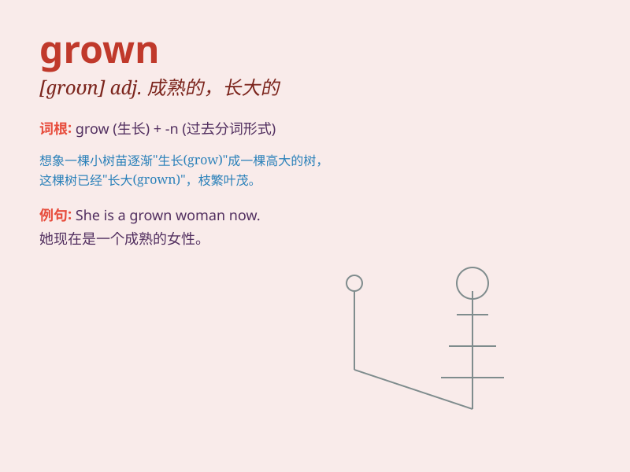

## grown

**英音:** _[grəʊn]_ **美音:** _[ɡron]_

**译义:** *adj.长大的,成年的,长满某物的 vbl.grow的过去分词*

### 短语

+ **grown up:** _成年的；成熟的_

+ **fully grown:** _完全长大的；成熟的_

+ **grown man:** _成年男子_

+ **grown woman:** _成年女子_

+ **grown children:** _已长大的孩子_

### 例句

#### 例句1

> **She has grown into a beautiful woman.**

**中文翻译:** 她已长成一个美丽的女人。

**单词释义:** 成长；变成

#### 例句2

> **The grown-ups were having a serious discussion.**

**中文翻译:** 大人们正在进行严肃的讨论。

**单词释义:** 成年的；成熟的

#### 例句3

> **The plants have grown very tall this summer.**

**中文翻译:** 今年夏天这些植物长得非常高。

**单词释义:** 生长；发育

### 背诵小故事

> Once upon a time, there was a little seed. With time and care, it
grew and became a big plant. We say it has grown. Grown means to have
developed and become larger or more mature.

**从前，有一颗小种子。随着时间和照料，它生长并变成了一棵大植物。我们说它已经长大了。grown
意思是已经发展、变得更大或更成熟。**

### 图义

