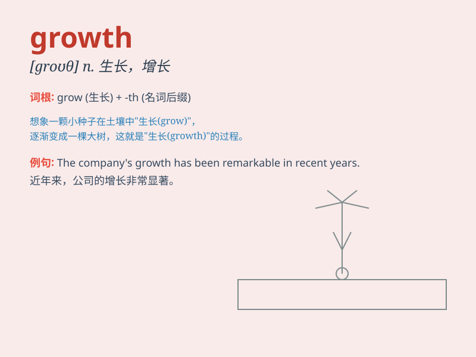

## growth

**英音:** _[grəʊθ]_ **美音:** _[ɡroθ]_

**译义:** *n.生长,种植,栽培,发育,等比级数*

### 短语

+ **economic growth:** _经济增长_

+ **population growth:** _人口增长_

+ **growth rate:** _增长率_

+ **steady growth:** _稳定增长_

+ **rapid growth:** _快速增长_

### 例句

#### 例句1

> **The growth of the economy has been steady this year.**

**中文翻译:** 今年经济的增长一直很稳定。

**单词释义:** 增长；发展

#### 例句2

> **Childhood is a period of rapid growth.**

**中文翻译:** 童年是生长迅速的时期。

**单词释义:** 生长；发育

#### 例句3

> **The company is focused on achieving sustainable growth.**

**中文翻译:** 这家公司专注于实现可持续的增长。

**单词释义:** 增长；发展

### 背诵小故事

> Once upon a time, a little seed was planted. With time and care, it
began to sprout and grow. It pushed through the soil, reaching for the
sun. This process of becoming bigger and stronger is called \'growth\'.

**从前，有一颗小种子被种下。随着时间和悉心照料，它开始发芽生长。它从土壤中钻出，努力朝着太阳生长。这个变得更大更强的过程就叫做'growth'（成长；生长）。**

### 图义

