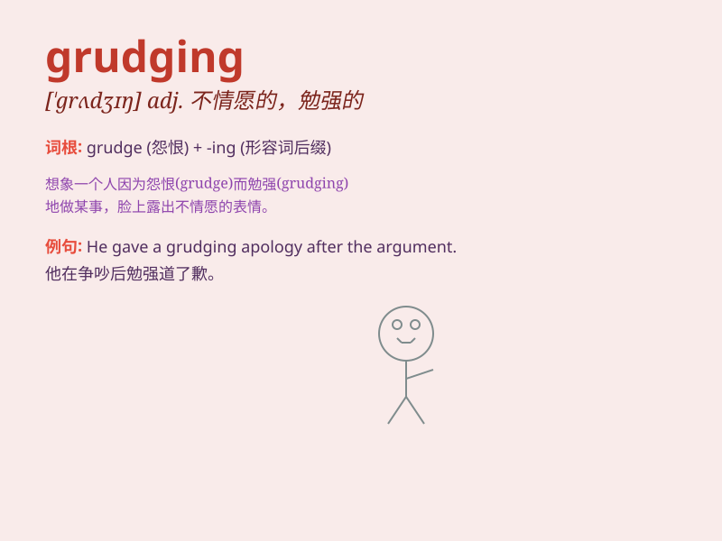

## grudging

**英音:** _[\'grʌdʒɪŋ]_ **美音:** _[\'ɡrʌdʒɪŋ]_

**译义:** *adj.不愿的,勉强的,吝啬的*

### 短语

+ **grudging admiration:** _勉强的钦佩_

+ **grudging consent:** _不情愿的同意_

+ **grudging recognition:** _勉强的认可_

+ **grudging respect:** _勉强的尊重_

+ **grudging acceptance:** _不情愿的接受_

### 例句

#### 例句1

> **He gave me a grudging apology.**

**中文翻译:** 他很不情愿地向我道了歉。

**单词释义:** 不情愿的；勉强的

#### 例句2

> **She accepted his help with grudging thanks.**

**中文翻译:** 她勉强地道了谢，接受了他的帮助。

**单词释义:** 不情愿的；勉强的

#### 例句3

> **There was grudging admiration for his opponent\'s skill.**

**中文翻译:** 对他对手的技巧勉强表示钦佩。

**单词释义:** 勉强的；不情愿的

### 背诵小故事

> One day, Tom won a game easily. But his friend Jack gave him a
grudging compliment. Jack was reluctant and unwilling to praise Tom
sincerely. This shows the meaning of \'grudging\'.

**有一天，汤姆轻松赢得了一场比赛。但他的朋友杰克不情愿地赞扬了他。杰克很勉强，并非真心地称赞汤姆。这体现了'grudging'不情愿的、勉强的意思。**

### 图义

