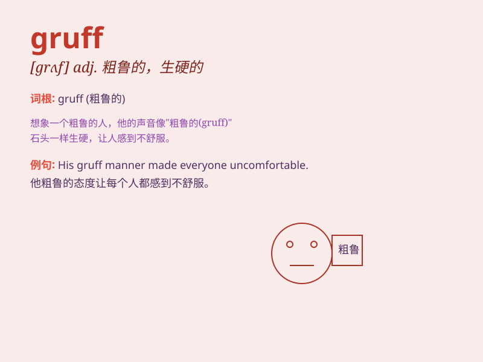

## gruff

**英音:** _[grʌf]_ **美音:** _[ɡrʌf]_

**译义:** *adj.(说话、态度等) 粗暴的,生硬的,脾气坏的,(声音)粗哑的*

### 短语

+ **gruff voice:** _粗哑的声音_

+ **gruff manner:** _粗暴的态度_

+ **gruff reply:** _生硬的回答_

+ **gruff exterior:** _生硬的外表_

+ **gruff tone:** _粗鲁的语气_

### 例句

#### 例句1

> **The old man has a gruff voice.**

**中文翻译:** 这位老人的声音粗哑。

**单词释义:** 粗哑的

#### 例句2

> **He gave a gruff reply and walked away.**

**中文翻译:** 他生硬地回答了一句就走开了。

**单词释义:** 生硬的

#### 例句3

> **The boss has a gruff manner, but he\'s fair.**

**中文翻译:** 老板态度粗暴，但他很公正。

**单词释义:** 粗暴的

### 背诵小故事

> A gruff bear lived in the forest. He always growled in a rough voice
when other animals came near. But one day, a little rabbit got lost and
was scared. The bear\'s gruff manner softened, and he helped the rabbit
find its way home.

**一只脾气粗暴的熊住在森林里。当其他动物靠近时，它总是用粗哑的声音咆哮。但有一天，一只小兔子迷路了很害怕。熊粗暴的态度变软了，它帮助兔子找到了回家的路。**

### 图义

