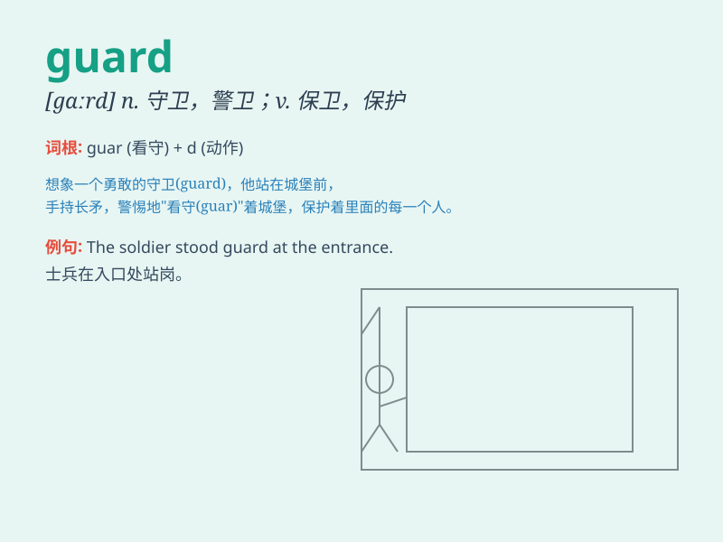

## guard

**英音:** _[gɑːd]_ **美音:** _[ɡɑrd]_

**译义:**
*n.守卫,警戒,护卫队,防护装置vt.保卫,看守,当心vi.防止,警惕,警卫*

### 短语

+ **on guard:** _站岗；警戒；警惕_

+ **off guard:** _不警惕；未防备_

+ **guard against:** _防范；预防；提防_

+ **stand guard:** _站岗；放哨_

+ **guard of honor:** _仪仗队_

### 例句

#### 例句1

> **The guard stood at the entrance of the building.**

**中文翻译:** 警卫站在大楼门口。

**单词释义:** 警卫

#### 例句2

> **You should always guard your personal information carefully.**

**中文翻译:** 您应该始终小心保护您的个人信息。

**单词释义:** 保护；守卫

#### 例句3

> **The dog is guarding the house.**

**中文翻译:** 狗正在看守房子。

**单词释义:** 守卫；看守

### 背诵小故事

> A thief tried to sneak into a house at night. But the brave guard was
on duty. He caught the thief and protected the house. The guard was like
a hero!

**一个小偷在晚上试图潜入一所房子。但是勇敢的守卫正在值班。他抓住了小偷并保护了房子。这个守卫就像一个英雄！**

### 图义

