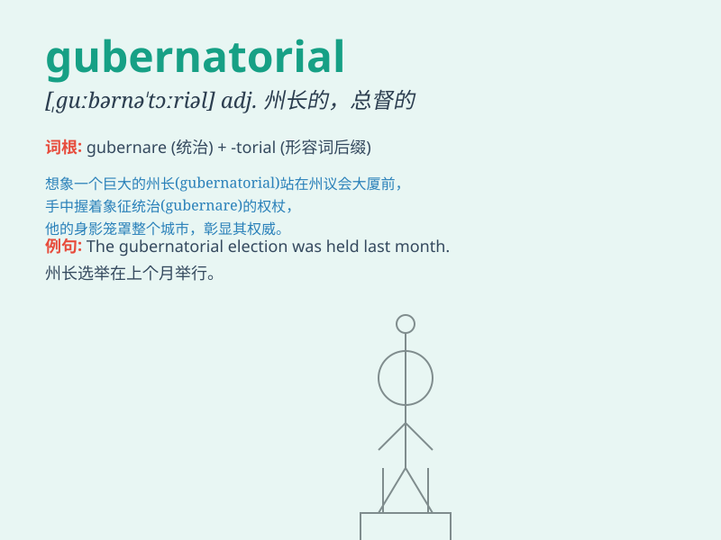

## gubernatorial

**英音:** _[ˌɡuːbənəˈtɔːriəl]_ **美音:**
_[ˌɡuːbərnəˈtɔːriəl]_

**译义:** *adj.统治者的,地方长官的,州长的,总督的*

### 短语

+ **gubernatorial election:** _州长选举_

+ **gubernatorial candidate:** _州长候选人_

+ **gubernatorial campaign:** _州长竞选活动_

+ **gubernatorial power:** _州长权力_

+ **gubernatorial term:** _州长任期_

### 例句

#### 例句1

> **The gubernatorial candidate promised to improve the economy.**

**中文翻译:** 这位州长候选人承诺改善经济。

**单词释义:** 与州长有关的

#### 例句2

> **The gubernatorial race was highly competitive.**

**中文翻译:** 州长竞选竞争非常激烈。

**单词释义:** 州长的

#### 例句3

> **She gave a speech on gubernatorial responsibilities.**

**中文翻译:** 她发表了关于州长职责的演讲。

**单词释义:** 州长职位的

### 背诵小故事

>
想象一个州长（governor）在选举期间，他的竞选团队为了让大家记住他，制作了一个特别的口号，里面包含了'gubernatorial'这个词，强调他的领导能力和治理（gubernatorial）理念。

**想象州长在选举时其团队用包含此词的口号强调其领导和治理理念来辅助记忆**

### 图义

