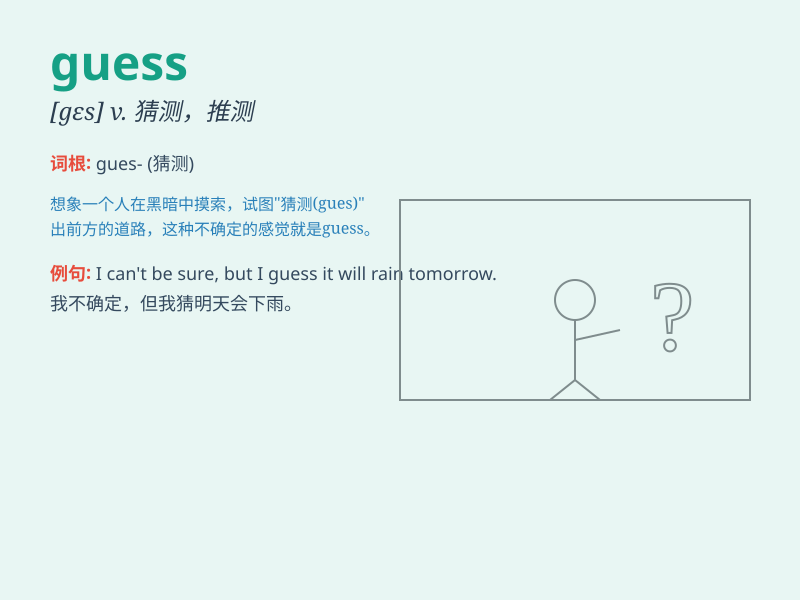

## guess

**英音:** _[ges]_ **美音:** _[ɡɛs]_

**译义:** *vt.猜测,推测,猜中,猜对,想,认为vi.猜,推测n.猜测,推测*

### 短语

+ **guess at:** _猜测；估计_

+ **wild guess:** _胡乱猜测_

+ **guesswork:** _猜测；推测_

+ **educated guess:** _有根据的猜测_

+ **make a guess:** _猜一下；进行猜测_

### 例句

#### 例句1

> **I guess it will rain tomorrow.**

**中文翻译:** 我猜明天会下雨。

**单词释义:** 猜测；推测

#### 例句2

> **Can you guess the answer to this riddle?**

**中文翻译:** 你能猜出这个谜语的答案吗？

**单词释义:** 猜；猜想

#### 例句3

> **She guessed my age wrongly.**

**中文翻译:** 她猜错了我的年龄。

**单词释义:** 猜中；猜对

### 背诵小故事

> One day, I found a mystery box. Everyone was trying to guess what was
inside. Some said toys, some said books. Finally, I opened it and it was
a beautiful cake! We all laughed because no one guessed it right.

**有一天，我发现了一个神秘的盒子。每个人都在努力猜测里面是什么。有人说玩具，有人说书。最后，我打开了它，原来是一个漂亮的蛋糕！我们都笑了，因为没人猜对。**

### 图义

