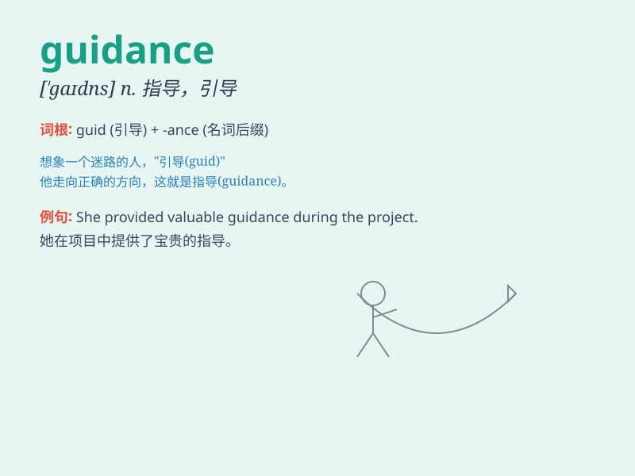

## guidance

**英音:** _[\'gaɪd(ə)ns]_ **美音:** _[\'gaɪdns]_

**译义:** *n.指导,领导*

### 短语

+ **career guidance:** _职业指导_

+ **moral guidance:** _道德指引_

+ **provide guidance:** _提供指导_

+ **under guidance:** _在指导下_

+ **guidance counselor:** _指导顾问_

### 例句

#### 例句1

> **The students sought guidance from their professor on the
difficult assignment.**

**中文翻译:** 学生们就这项艰巨的作业向教授寻求指导。

**单词释义:** 指导；引导

#### 例句2

> **Under his guidance, the team achieved remarkable success.**

**中文翻译:** 在他的带领下，团队取得了令人瞩目的成功。

**单词释义:** 指导；指引

#### 例句3

> **She needed some guidance to make the right career choice.**

**中文翻译:** 她需要一些指导来做出正确的职业选择。

**单词释义:** 指导；建议

### 背诵小故事

> A lost traveler was wandering in the forest. Just when he felt
hopeless, an old wise man appeared and provided guidance. The traveler
followed the directions and finally found his way out. The wise man\'s
help was like the meaning of \'guidance\'.

**一位迷路的旅行者在森林里徘徊。就在他感到绝望时，一位睿智的老人出现并给予了指导。旅行者遵循指示，最终找到了出路。老人的帮助就如同'guidance'这个词的含义。**

### 图义

